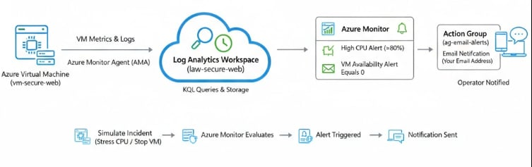

# Project 2: Azure Monitoring, Log Analytics & Alerts (Operational Readiness)

## Overview

This project builds on **Project 1** and focuses on **operational visibility and incident readiness**. The goal is to ensure that deployed resources are **observable, monitored, and capable of triggering alerts** when issues occur — a core responsibility of a Junior Cloud Engineer.

Rather than passively viewing metrics, this project simulates **real-world monitoring and incident response scenarios** using Azure-native tools.

---

## Objectives

* Enable centralized logging and monitoring for Azure resources
* Collect VM performance and system logs
* Create actionable alerts for common infrastructure issues
* Simulate incidents and validate alert behavior
* Understand how monitoring supports uptime and reliability

---

## Architecture

**Components Used:**

* Azure Virtual Machine (from Project 1)
* Azure Monitor
* Log Analytics Workspace
* Diagnostic Settings
* Action Group (Email Notification)

**Data Flow:**

* VM metrics and logs → Log Analytics Workspace
* Azure Monitor evaluates metrics → triggers alerts → notifies operator



---

## Step-by-Step Implementation (Mentor-Guided)

### Step 1: Create a Log Analytics Workspace

**Why this matters:** Centralized logging is required for troubleshooting, auditing, and incident investigation.

1. Go to **Azure Portal** → **Log Analytics workspaces** → **Create**
2. Configure:

   * Resource Group: `rg-secure-vm-web`
   * Name: `law-secure-web`
   * Region: Same region as the VM
3. Review + Create → Create

📸 Screenshot: Log Analytics Workspace overview

---

### Step 2: Enable VM Insights / Monitoring Agent

**Why this matters:** Without an agent, the VM cannot send detailed performance data.

1. Go to **Virtual machines** → `vm-secure-web`
2. Select **Insights** or **Monitoring** → **Enable**
3. When prompted:

   * Select the existing workspace: `law-secure-web`
4. Confirm installation of monitoring agent

📸 Screenshot: VM Insights enabled

---

### Step 3: Configure Diagnostic Settings

**Why this matters:** Diagnostic settings control what data is collected and retained.

1. Go to **Virtual machine** → **Diagnostic settings**
2. Click **Add diagnostic setting**
3. Configure:

   * Logs: AuditLogs, SecurityEvent (if available)
   * Metrics: All metrics
   * Destination: Send to Log Analytics workspace
   * Workspace: `law-secure-web`
4. Save

📸 Screenshot: Diagnostic settings configuration

---

### Step 4: Validate Log Collection with KQL

**Why this matters:** Engineers verify logs before trusting alerts.

1. Go to **Log Analytics workspace** → **Logs**
2. Run:

```kql
Perf
| limit 10
```

3. Confirm results are returned

📸 Screenshot: KQL query results

---

### Step 5: Create an Action Group (Alert Notification)

**Why this matters:** Alerts without notifications are useless.

1. Go to **Azure Monitor** → **Alerts** → **Manage action groups**
2. Create Action Group:

   * Name: `ag-email-alerts`
   * Notification type: Email
   * Email: Your email address
3. Review + Create

📸 Screenshot: Action group configuration

---

### Step 6: Create Metric Alerts

#### Alert 1: High CPU Usage

1. Azure Monitor → Alerts → Create → Alert rule
2. Scope: `vm-secure-web`
3. Condition:

   * Signal: Percentage CPU
   * Operator: Greater than
   * Threshold: 80
   * Aggregation: Average
   * Frequency: 5 minutes
4. Action Group: `ag-email-alerts`
5. Severity: 2 (Warning)
6. Create

📸 Screenshot: CPU alert rule

---

#### Alert 2: VM Availability

1. Create another alert rule
2. Signal: VM Availability Metric
3. Condition: Equals 0
4. Action Group: `ag-email-alerts`
5. Severity: 1 (Critical)

📸 Screenshot: Availability alert

---

### Step 7: Simulate Incidents

**Why this matters:** Testing proves alerts actually work.

#### CPU Stress Test:

SSH into the VM and run:

```bash
sudo apt install -y stress
stress --cpu 2 --timeout 300
```

Confirm alert email is received.

#### Availability Test:

* Stop the VM from Azure Portal
* Confirm alert is triggered

📸 Screenshot: Alert email received

---

## Validation Checklist

* Logs visible in Log Analytics
* KQL queries return data
* Alerts trigger as expected
* Notifications received

---

## Cost Awareness

* Monitoring enabled only for required resources
* Alerts configured with reasonable thresholds
* Workspace reused across projects

---

## Cleanup (Optional)

* Disable alerts if no longer needed
* Retain Log Analytics Workspace for future projects

---

## Key Skills Demonstrated

* Azure Monitor configuration
* Log Analytics and KQL basics
* Alert creation and tuning
* Incident simulation and validation

---

## Resume Bullet (Ready to Use)

> Implemented Azure Monitor and Log Analytics to collect VM metrics and logs, configured alerts for performance and availability issues, and validated alerting through simulated incidents.

---

## Lessons Learned

* Monitoring must be validated, not assumed
* Alert fatigue is avoided through proper thresholds
* Logs are essential for incident investigation

---

## Status

🟡 In Progress – Operational monitoring enabled
