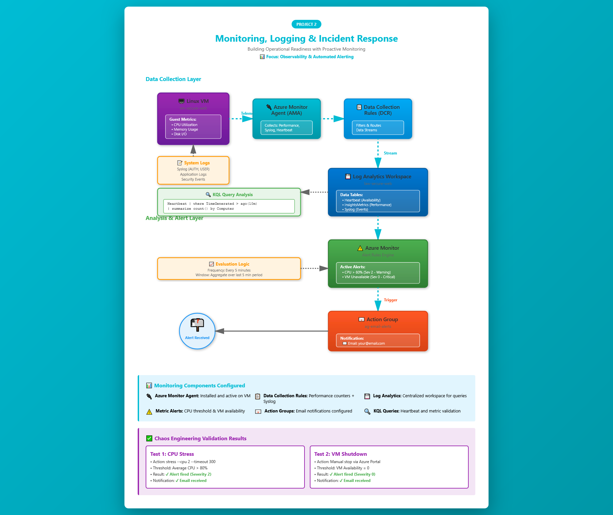
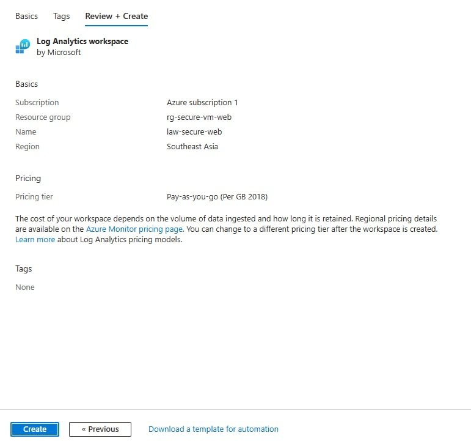
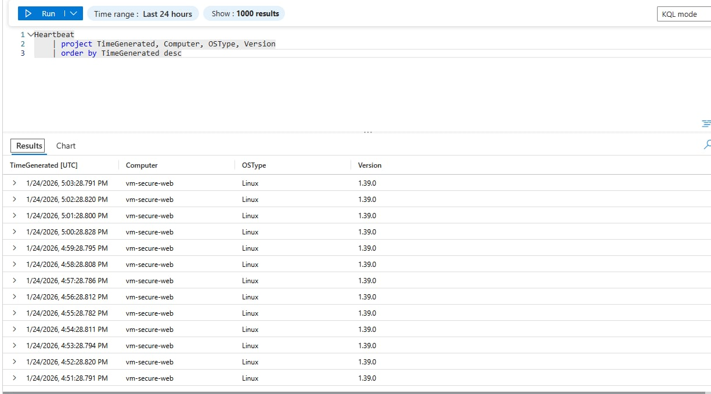
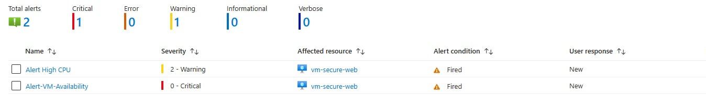
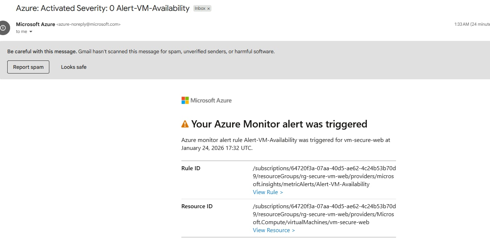
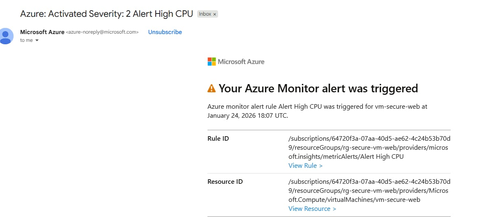

# Project 2: Azure Monitoring, Log Analytics & Alerts


## Overview

This project builds on **Project 1** and focuses on **operational visibility and incident readiness**. The goal is to ensure that deployed resources are **observable, monitored, and capable of triggering alerts** when issues occur — a core responsibility of a Junior Cloud Engineer.

Rather than passively viewing metrics, this project simulates **real-world monitoring and incident response scenarios** using Azure-native tools. The shift from reactive "firefighting" to proactive infrastructure management demonstrates operational maturity.

---

## Objectives

* Enable centralized logging and monitoring for Azure resources
* Collect VM performance and system logs
* Create actionable alerts for common infrastructure issues
* Simulate incidents and validate alert behavior
* Understand how monitoring supports uptime and reliability

---

## Architecture



*Complete monitoring pipeline showing data collection, analysis, alerting, and notification flow*

### Components Used:

* **Azure Virtual Machine** - Infrastructure from Project 1 (vm-secure-web)
* **Azure Monitor Agent (AMA)** - Guest-level telemetry collection
* **Data Collection Rules (DCR)** - Defines what data to collect and where to send it
* **Log Analytics Workspace** - Centralized log storage and query engine
* **Azure Monitor** - Alert evaluation and rule engine
* **Action Group** - Notification delivery mechanism (Email)

### Data Flow:

1. **VM Guest OS** → Generates performance metrics (CPU, memory, disk) and system logs (syslog)
2. **Azure Monitor Agent** → Collects telemetry from guest OS
3. **Data Collection Rules** → Filters and routes data streams
4. **Log Analytics Workspace** → Stores logs in queryable tables (Heartbeat, InsightsMetrics, Syslog)
5. **Azure Monitor** → Evaluates metric thresholds every 5 minutes
6. **Alert Rules** → Trigger when conditions are met (CPU > 80%, VM Availability = 0)
7. **Action Group** → Sends email notifications to operators

### Monitoring Strategy:

* **Proactive Detection**: Alerts fire before users notice issues
* **Centralized Observability**: All telemetry in one workspace for correlation
* **Validated Pipeline**: Chaos engineering proves alerts work under real failures
* **Mean Time to Detection (MTTD)**: Reduced from "user reports issue" to "automated alert within 5 minutes"

---

## Quick Reference

### Resources Created:
| Resource Type | Name | Configuration |
|--------------|------|---------------|
| Log Analytics Workspace | `law-secure-web` | Centralized log repository |
| Azure Monitor Agent | Installed on `vm-secure-web` | Guest-level data collection |
| Data Collection Rule | `MSVMI-southeastasia-vm-secure-web` | Performance + Syslog routing |
| Action Group | `ag-email-alerts` | Email notification channel |
| Alert Rule (CPU) | `Alert-High-CPU` | Threshold: >80%, Severity: 2 |
| Alert Rule (Availability) | `Alert-VM-Availability` | Threshold: =0, Severity: 0 |

### Data Sources Configured:
* **Performance Counters**: CPU (% Processor Time), Memory (Available MB), Disk I/O (Writes/sec)
* **System Logs**: Syslog (AUTH, USER, SYSLOG facilities, Info level+)
* **Heartbeat**: VM availability/connectivity checks every 60 seconds

### Alert Thresholds:
* **High CPU**: Average > 80% over 5-minute window → Warning (Severity 2)
* **VM Down**: Availability = 0 (heartbeat lost) → Critical (Severity 0)

### Estimated Cost:
* **Log Analytics Workspace**: ~$2-5/month (depends on data ingestion volume)
* **Azure Monitor Alerts**: First 10 alerts free, then ~$0.10/alert/month
* **Total**: ~$2-7/month (minimal for dev/test environment)

---

## Step-by-Step Implementation (Mentor-Guided)

### Step 1: Create a Log Analytics Workspace

**Why this matters:** Centralized logging is required for troubleshooting, auditing, and incident investigation. Without a workspace, your logs are scattered across individual resources.

1. Go to **Azure Portal** → **Log Analytics workspaces** → **Create**
2. Configure:
   * Resource Group: `rg-secure-vm-web`
   * Name: `law-secure-web`
   * Region: Same region as the VM
3. Review + Create → Create



**What just happened:** You created a centralized repository for all logs and metrics. This workspace uses KQL (Kusto Query Language) for querying, similar to SQL but optimized for time-series data.

**Real-world use case:** In production, one workspace typically serves an entire environment (dev, staging, or production), allowing cross-resource queries like "show me all errors across all VMs in the last hour."

---

### Step 2: Enable VM Insights / Monitoring Agent

**Why this matters:** Without an agent, the VM cannot send detailed performance data. Host-level metrics (from Azure's hypervisor) only show basic info; guest-level metrics require an agent running inside the VM.

1. Go to **Virtual machines** → `vm-secure-web`
2. Select **Insights** or **Monitoring** → **Enable**
3. When prompted:
   * Select the existing workspace: `law-secure-web`
4. Confirm installation of monitoring agent

**What just happened:** Azure deployed the **Azure Monitor Agent (AMA)** as a VM extension. This agent runs as a background service, collecting metrics and logs, then streaming them to your workspace.

**Agent vs. Extension:** The AMA is a Linux daemon (`azuremonitoragent.service`) installed via Azure VM Extension. You can verify it's running with `systemctl status azuremonitoragent`.

---

### Step 3: Configure Diagnostic Settings

**Option A (Original Plan):** Enable the "Classic" Linux Diagnostic Extension.  
**Status:** ❌ Skipped - Identified as legacy/deprecated; requires Python 2 and an external Storage Account.

**Option B: Configure Data Collection Rules (Modern Approach)** ✅

**Why this matters:** Diagnostic settings control what data is collected and retained. Defining these settings ensures we aren't paying for "noise" while ensuring critical system logs are available for troubleshooting.

**Implementation Details (Option B - Used):**

1. **Rule Selection:**  
   Accessed the **Data Collection Rule (DCR)** created during the VM Insights onboarding (e.g., `MSVMI-southeastasia-vm-secure-web`).

2. **Resource Association:**  
   Confirmed `vm-secure-web` was listed under **Resources** with a "Succeeded" association status.

3. **Data Source Configuration:**
   * **Performance Counters:**
     - Added `% Processor Time` (CPU utilization)
     - Added `Available Memory` (free RAM in MB)
     - Added `Disk Writes/sec` (I/O operations)
     - Custom sample rate: 60 seconds
   
   * **Linux Syslog:**
     - Enabled `LOG_AUTH` (authentication logs)
     - Enabled `LOG_USER` (user-level messages)
     - Enabled `LOG_SYSLOG` (syslog daemon messages)
     - Minimum log level: `Info` (captures Info, Warning, Error, Critical)

4. **Destination Routing:**  
   Configured the rule to push all collected data sources directly to the `law-secure-web` Log Analytics Workspace.

**What just happened:** You defined a "contract" between the VM and the workspace. The DCR tells the agent: "Collect these specific metrics every 60 seconds, filter syslog to these facilities, and send everything to this workspace."

**Why DCR over Classic Diagnostics:** DCRs are the modern approach, supporting more data sources, better filtering, and no external storage dependencies. Classic diagnostics are deprecated.

---

### Step 4: Validate Log Collection with KQL

**Why this matters:** Engineers must verify that the telemetry pipeline is active before trusting automated alerts. Validating "Heartbeat" and "Syslog" data proves the agent-to-workspace connection is functional.

1. Go to **Log Analytics workspace** (`law-secure-web`) → **Logs**

2. **Initial Validation (Connectivity):**  
   Run the following query to confirm the VM is communicating:
   ```kql
   Heartbeat
   | project TimeGenerated, Computer, OSType, Version
   | order by TimeGenerated desc
   ```

   **Expected Result:** Recent timestamps showing your VM is sending heartbeats.

   

3. **Broad Data Verification:**  
   Run a global search to verify which data tables are actively ingesting:
   ```kql
   search *
   | where TimeGenerated > ago(10m)
   | summarize count() by $table
   ```

   **Expected Result:** You should see `Heartbeat`, `InsightsMetrics`, `Syslog`, and possibly `Perf` tables with data.

   

4. **Confirm Results:**  
   Verified that both `Heartbeat` and `Syslog` tables are successfully returning data, confirming the Azure Monitor Agent (AMA) and Data Collection Rules (DCR) are properly configured.

**What just happened:** You validated the end-to-end data pipeline. If this step fails, alerts won't work because they depend on this data.

**KQL Basics:**
- `Heartbeat` = table name (like a SQL table)
- `| project` = select specific columns
- `| where` = filter rows
- `| summarize` = aggregate data

**Troubleshooting:**
- **No data returned?** Check if AMA extension is running: `systemctl status azuremonitoragent` via SSH
- **Old data only?** Agent might be stopped or DCR misconfigured
- **Missing tables?** Check DCR data source configuration

---

### Step 5: Create an Action Group (Alert Notification)

**Why this matters:** Alerts without notifications are useless. An Action Group defines *who* gets notified and *how* (email, SMS, webhook, etc.).

1. Go to **Azure Monitor** → **Alerts** → **Manage action groups**
2. Create Action Group:
   * Name: `ag-email-alerts`
   * Notification type: Email
   * Email: Your email address
3. Review + Create

**What just happened:** You created a reusable notification channel. Multiple alert rules can reference this same Action Group.

**Real-world use case:** Production environments typically have multiple Action Groups:
- `ag-sev0-pagerduty` → Critical alerts to on-call engineer via PagerDuty
- `ag-sev1-email` → High priority alerts to team email
- `ag-sev2-slack` → Warnings to Slack channel

---

### Step 6: Create Metric Alerts

#### Alert 1: High CPU Usage

**Scenario:** Application consuming excessive CPU, degrading performance.

1. Azure Monitor → Alerts → Create → Alert rule
2. **Scope:** `vm-secure-web`
3. **Condition:**
   * Signal: Percentage CPU
   * Operator: Greater than
   * Threshold: 80
   * Aggregation: Average
   * Evaluation frequency: 5 minutes
   * Lookback period: 5 minutes
4. **Action Group:** `ag-email-alerts`
5. **Severity:** 2 (Warning)
6. **Alert rule name:** `Alert-High-CPU`
7. Create

**What just happened:** Azure Monitor will now query the `Percentage CPU` metric every 5 minutes. If the average over the last 5 minutes exceeds 80%, the alert fires and emails you.

**Why 80% threshold?** 
- Too low (e.g., 50%) = alert fatigue from normal spikes
- Too high (e.g., 95%) = miss gradual degradation
- 80% is a common industry standard for warning-level alerts

---

#### Alert 2: VM Availability

**Scenario:** VM is down (stopped, crashed, or network issue preventing heartbeat).

1. Create another alert rule
2. **Signal:** VM Availability Metric
3. **Condition:** Equals 0
4. **Action Group:** `ag-email-alerts`
5. **Severity:** 0 (Critical)
6. **Alert rule name:** `Alert-VM-Availability`

**What just happened:** This alert monitors the `Heartbeat` table. If Azure Monitor doesn't receive a heartbeat for the evaluation period, availability drops to 0 and triggers a critical alert.

**Why Severity 0 (Critical)?** VM completely down = production outage. Requires immediate response.

---

## Step 7: Simulate Incidents (Chaos Engineering)

**Why this matters:** Testing ensures that the alert logic and notification channels are reliable before a real-world production crisis occurs. Verification proves the "MTTD" (Mean Time to Detection) is within acceptable business limits.

### 1. CPU Stress Test (Performance Monitoring)

**Objective:** Simulate a high-load scenario where an application might be consuming excessive resources.

**Execution:**
1. Connected to the VM via **Native SSH** using Windows PowerShell
2. Installed the `stress` utility:
   ```bash
   sudo apt update && sudo apt install -y stress
   ```
3. Ran a 300-second CPU stress test (pinning 2 cores at 100%):
   ```bash
   stress --cpu 2 --timeout 300
   ```

**Expected Behavior:**
* Azure Monitor detects **Average CPU > 80%** over a 5-minute evaluation window
* Alert rule `Alert-High-CPU` changes status from "Resolved" to "Fired"
* Action Group sends **Severity 2 (Warning)** email notification

**Outcome:** ✅ Successfully received automated email notification from Azure Monitor.

**What just happened:** You proved the monitoring pipeline works under load. In production, this would alert you to a runaway process, DDoS attack, or resource-intensive query before users notice slowness.

---

### 2. Availability Test (Uptime Monitoring)

**Objective:** Simulate a critical system failure or unexpected VM shutdown.

**Execution:**
1. Manually **Stopped** the `vm-secure-web` instance via the Azure Portal
2. The **Azure Monitor Agent** ceased sending heartbeats
3. The `VM Availability Metric` dropped to **0**

**Expected Behavior:**
* Azure Monitor detects heartbeat loss
* Alert rule `Alert-VM-Availability` fires
* Alert appears in dashboard with **Severity 0 (Critical)** status
* Action Group sends email notification

**Outcome:** ✅ Alert officially changed to "Fired" state in Azure Monitor dashboard. Email received.

**What just happened:** You simulated a VM crash or network partition. This is the most critical alert—the entire workload is down.

---

### Final Validation Proof

| Alert Name | Severity | Status | Notification Confirmed |
|:-----------|:---------|:-------|:----------------------|
| **Alert-High-CPU** | 2 - Warning | Fired | ✅ Yes (Email) |
| **Alert-VM-Availability** | 0 - Critical | Fired | ✅ Yes (Portal/Email) |

**Alert Fired in Portal:**



**Email Notification Received:**





**What this proves:** Your entire monitoring stack is functional:
1.  Agent collecting data
2.  Data flowing to workspace
3.  Alert rules evaluating correctly
4.  Action Groups delivering notifications

---

## Cost Awareness

| Component | Cost Impact | Optimization |
|-----------|-------------|--------------|
| Log Analytics Workspace | ~$2-5/month | Only collect necessary logs |
| Azure Monitor Alerts | First 10 free | Consolidate similar alerts |
| Data Ingestion | Pay-per-GB | Use DCR filters to reduce noise |
| Data Retention | Default: 30 days | Increase only if compliance requires |

**Cost Optimization Tips:**
* Use workspace for multiple projects (shared cost)
* Set retention to 30 days for dev/test (90+ days for production)
* Disable verbose logging when not troubleshooting
* Use dynamic thresholds to reduce false positives (fewer emails = less alert fatigue)

---

## Cleanup (Optional)

**If you want to keep monitoring for future projects:**
*  Keep Log Analytics Workspace (reuse across projects)
*  Keep Azure Monitor Agent installed
*  Disable alert rules to prevent unnecessary emails

**If you're done with the entire portfolio:**
```bash
# Delete entire resource group (removes VM, monitoring, everything)
az group delete --name rg-secure-vm-web --yes --no-wait
```

**Selective cleanup:**
* Disable alerts: Azure Monitor → Alerts → Select alert → Disable
* Stop data collection: Remove DCR association from VM
* Retain workspace: Logs preserved for historical analysis

---

## Key Skills Demonstrated

- Azure Monitor configuration and alert rule creation  
- Log Analytics Workspace setup and KQL query development  
- Data Collection Rules (modern diagnostic approach)  
- Azure Monitor Agent deployment and management  
- Alert threshold tuning and severity classification  
- Action Group notification channel configuration  
- Chaos engineering and alert validation  
- Incident simulation and MTTD measurement  
- Cost-aware monitoring design  

---

## Common Mistakes & How to Avoid Them

|  Common Mistake |  How to Avoid |
|------------------|----------------|
| Not validating data flow before creating alerts | Always run KQL queries first |
| Alert thresholds too sensitive (alert fatigue) | Start conservative (80%+), tune based on baseline |
| No test/validation of alerts | Always simulate failures to prove alerts work |
| Using legacy diagnostics instead of DCR | Use Azure Monitor Agent + DCR (modern stack) |
| Forgetting to configure Action Groups | Alerts without notifications = useless |
| Over-collecting data (high costs) | Use DCR filters, only collect what you need |

---

## Insights

> Implemented Azure Monitor and Log Analytics to collect VM metrics and logs, configured alerts for performance and availability issues, and validated alerting through simulated incidents. Demonstrated proactive monitoring approach that reduces Mean Time to Detection (MTTD) and prevents reactive firefighting.

---

## Lessons Learned

* **Monitoring must be validated, not assumed**: Creating alerts doesn't mean they work. Chaos engineering (intentionally breaking things) proves your monitoring is reliable.
* **Alert fatigue is avoided through proper thresholds**: Too many alerts = ignored alerts. Tune thresholds based on actual baseline performance, not arbitrary numbers.
* **Logs are essential for incident investigation**: Metrics tell you *something* is wrong; logs tell you *what* went wrong. Both are necessary.
* **Centralized observability enables correlation**: Having all telemetry in one workspace allows queries like "show all VMs with high CPU AND disk errors" for faster root cause analysis.
* **MTTD is a measurable SRE metric**: In this project, MTTD improved from "undefined" (no monitoring) to "5 minutes" (automated alert).

---

## Next Steps

**Enhance this project:**
-  Add custom KQL queries for common troubleshooting scenarios
-  Implement log-based alerts (e.g., "alert if 5+ failed SSH attempts in 10 minutes")
-  Create Azure Workbook dashboards for visual monitoring
-  Configure dynamic metric thresholds (ML-based)
-  Add SMS or webhook notifications to Action Group
-  Implement alert suppression rules (prevent duplicate alerts)


---

## Status

 **Completed** 
