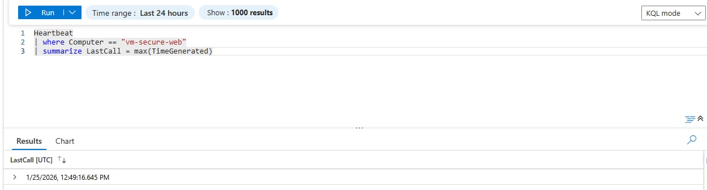
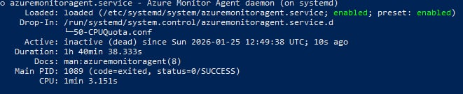
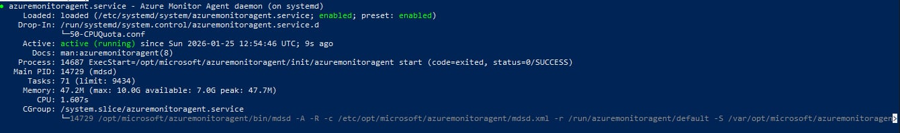

# Project 3: Azure Troubleshooting & Root Cause Analysis (Production Simulation)

## Overview

This project focuses on **troubleshooting, investigation, and root cause analysis (RCA)** — core responsibilities of a Junior Cloud Engineer supporting live environments.

Unlike deployment projects, this project intentionally introduces **failures and misconfigurations** and requires diagnosing issues using Azure-native tools, logs, and systematic thinking.

This simulates real on-call and support scenarios where engineers must restore service quickly and safely.

---

## Objectives

* Practice systematic troubleshooting of Azure infrastructure issues
* Identify root causes using logs, metrics, and configuration review
* Restore service with minimal impact
* Document findings in a professional RCA format

---

## Architecture

**Components Used:**

* Azure Virtual Machine (Linux)
* Azure Virtual Network & Subnet
* Network Security Group (NSG)
* Azure Monitor & Log Analytics


---

## Troubleshooting Methodology (Used for All Scenarios)

1. Identify symptoms (what is broken)
2. Check monitoring alerts and metrics
3. Review recent configuration changes
4. Isolate the failing component
5. Apply fix
6. Validate service restoration
7. Document root cause

This structured approach mirrors real production incident handling.

---

## Scenario 1: Web Application Unreachable (NSG Misconfiguration)

### Problem Introduced
Inbound HTTP traffic was blocked by deleting the existing allow rule, simulating a common production misconfiguration where security rules are accidentally removed.

### Symptoms
* **Browser Error:** `52.237.81.46` returned `ERR_CONNECTION_TIMED_OUT`.
* **Resource Status:** Azure Portal confirmed `vm-secure-web` was in a "Running" state.

### Investigation Steps
* **Verified Connectivity:** Confirmed the VM was responsive via the Azure Portal.
* **Network Analysis:** Used **Azure Network Watcher: IP Flow Verify**.
* **Packet Details:** Tested Protocol TCP, Local Port 80, and Remote Port *. The tool confirmed traffic was "Denied" by the NSG.

### Root Cause
The Inbound Security Rule for HTTP (Port 80) was missing from `nsg-secure-web`, causing the default `DenyAllInBound` rule to block all incoming web traffic.

### Resolution
* **Created Rule:** Added a new Inbound Security Rule.
* **Configuration:** Protocol: TCP, Destination Port: 80, Action: Allow, Priority: 100.

### Validation
* **Status:** Website successfully loaded the Nginx "Welcome" page.
* **Tool Confirmation:** Re-ran IP Flow Verify; result changed to "Allowed."


---

## Scenario 2: High Disk Usage Causing Service Failure

### Problem Introduced
* Simulated a storage failure by creating a large 25GB dummy file using the `fallocate` command.
* Targeted the root partition (`/dev/root`) to observe system behavior when storage is near 100% capacity.

### Symptoms
* **System Alert:** The OS reported "No space left on device" during write operations.
* **Storage Status:** CLI check `df -h` showed 99% disk utilization with only 378MB remaining.

 

### Investigation Steps
* **Azure Portal:** Monitored **OS Disk Write Bytes/Sec** in the Metrics blade to identify the exact time of the storage spike.


  * **CLI Analysis:** Connected via SSH and used `df -h` to identify the saturated partition.
* **File Discovery:** Used `ls -lh /tmp` to find the specific file causing the saturation.

### Root Cause
* Insufficient disk space available for application operations and system logging due to a large temporary file (`/tmp/disk_filler.img`).

### Resolution
* **Manual Cleanup:** Reclaimed space by deleting the filler file using `sudo rm /tmp/disk_filler.img`.
* **Preventative Measure:** Real-world resolution would include setting up Azure Monitor Alerts for disk thresholds exceeding 80%.

 

### Validation
* **Space Verification:** Confirmed disk usage returned to a baseline of 14% via `df -h`.
* **Metric Baseline:** Observed the disk write metrics return to idle levels in the Azure Portal.

 

---

## Scenario 3: Access Denied (RBAC Misconfiguration)

### **Problem Introduced**
* Simulated a scenario where a team member, **Test User One**, was unable to perform administrative tasks on the production Virtual Machine.
* Purpose: To demonstrate the impact of **Role-Based Access Control (RBAC)** on resource management and security governance.

### **Symptoms**
* **Authorization Errors:** The user received "Access Denied" or "Authorization Failed" notifications when attempting to trigger a VM restart.
* **Restricted UI:** Management actions (Start/Stop/Restart) were greyed out or resulted in permission errors in the Azure Portal.

### **Investigation Steps**
* **Check Access:** Utilized the **"Check access"** dashboard in the **Access Control (IAM)** blade of the resource group `rg-secure-vm-web`.
* **Role Audit:** Reviewed the **Role assignments** tab to verify the specific roles assigned to the user.
* **Discovery:** Identified that the user was assigned the **Reader** role at the Subscription/Resource Group level.


### **Root Cause**
* **RBAC Misconfiguration:** The **Reader** role is a non-privileged role that allows for visibility but lacks the "Write" permissions required for the `Microsoft.Compute/virtualMachines/restart/action`. The user was missing the **Virtual Machine Contributor** role.

### **Resolution**
* **Role Elevation:** Corrected the assignment by adding the **Virtual Machine Contributor** role to **Test User One** at the Resource Group scope.
* **Cleanup:** Removed any redundant or overly restrictive roles that conflicted with the required administrative duties.


### **Validation**
* **Permission Confirmation:** Re-ran the **Check access** tool, which confirmed the user now has the effective permissions of a **Virtual Machine Contributor**.
* **Action Test:** Verified that the user can now successfully perform power management actions on the VM.

---

## Scenario 4: Monitoring Data Missing (Agent Failure)

### **Problem Introduced**
* Simulated a total monitoring blackout by stopping the **Azure Monitor Agent (AMA)** service on the Linux Virtual Machine.
* Mimicked a scenario where the monitoring agent crashes or fails to initialize, resulting in a loss of critical telemetry.


### **Symptoms**
* **Data Gap:** A complete cessation of new entries in Log Analytics tables, specifically `Heartbeat` and `InsightsMetrics`.
* **Alert Failure:** Proactive alerts stopped triggering due to the lack of incoming performance data.
* **Portal Silence:** Guest-level metrics for CPU and Memory displayed "No Data" or became stagnant.

- Observation: You will notice that the "LastCall" time stops updating or no results appear for the current time.
 

### **Investigation Steps**
* **Extension Audit:** Verified the **Extensions + applications** blade in the Azure Portal; confirmed the `AzureMonitorLinuxAgent` extension was "Succeeded," suggesting a service-level rather than an installation-level issue.
* **System Check:** Connected via SSH and audited the agent service status:
  ```bash
  systemctl status azuremonitoragent
  ```
- Discovery: The service was found to be in an inactive (dead) state.



### Root Cause
- The Azure Monitor Agent (AMA) process was stopped or misconfigured, breaking the communication path between the Guest OS and the Log Analytics Workspace.

### Resolution
- Service Recovery: Restored the telemetry pipeline by restarting the agent service:
```
sudo systemctl start azuremonitoragent
```
- Persistence: Enabled the service to ensure automatic startup during future boot cycles:
```
sudo systemctl enable azuremonitoragent
```


### Validation
- Telemetry Resumption: Verified in Log Analytics that Heartbeat records resumed with current timestamps.
- Metric Flow: Confirmed the Metrics blade resumed displaying live performance data in the Azure Portal.


## Key Skills Demonstrated

* Incident investigation
* Root cause analysis
* Azure networking and security troubleshooting
* Log and metric analysis
* Service restoration

---

## Insights

> Diagnosed and resolved multiple Azure infrastructure incidents by analyzing logs, metrics, and configuration errors, performing root cause analysis, and restoring service availability.

---

## Lessons Learned

* Small configuration changes can cause major outages
* Monitoring accelerates troubleshooting
* Structured RCA improves response time

---

## Status

🟡 In Progress – Troubleshooting scenarios executed
