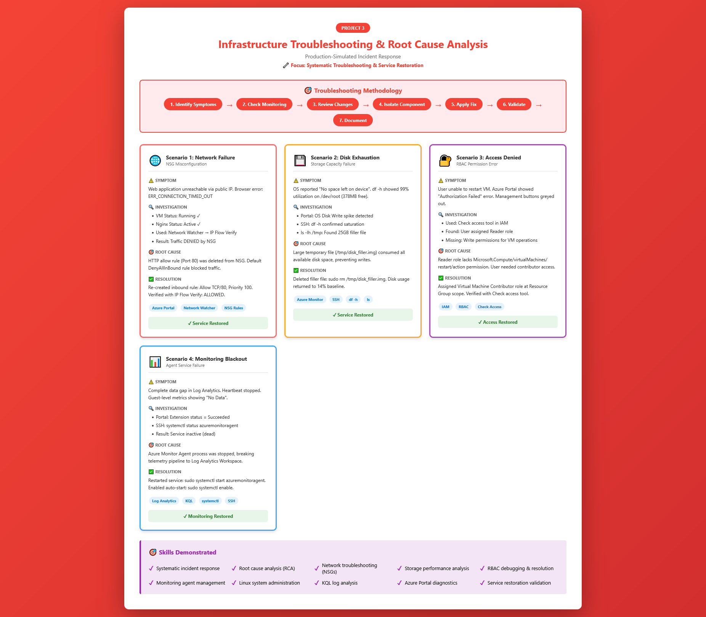

# Project 3: Azure Infrastructure Troubleshooting & Root Cause Analysis

  

## Overview

This project focuses on **troubleshooting, investigation, and root cause analysis (RCA)** — core responsibilities of a Junior Cloud Engineer supporting live environments.

Unlike deployment projects, this project intentionally introduces **failures and misconfigurations** and requires diagnosing issues using Azure-native tools, logs, and systematic thinking. This simulates real on-call and support scenarios where engineers must restore service quickly and safely.

**Key Difference from Projects 1 & 2:** Instead of building infrastructure, you're **fixing broken infrastructure** using systematic incident response methodologies.

---

## Objectives

* Practice systematic troubleshooting of Azure infrastructure issues
* Identify root causes using logs, metrics, and configuration review
* Restore service with minimal impact
* Document findings in a professional RCA format
* Demonstrate operational resilience and problem-solving under pressure

---

## Architecture



*Four production-simulated failure scenarios demonstrating systematic troubleshooting methodology*

### Components Used:

* **Azure Virtual Machine (Linux)** - Ubuntu Server with Nginx (from Project 1)
* **Azure Virtual Network & Subnet** - Network infrastructure
* **Network Security Group (NSG)** - Firewall rules subject to misconfiguration
* **Azure Monitor & Log Analytics** - Telemetry and diagnostics (from Project 2)
* **Azure RBAC** - Identity and access management
* **Linux System Services** - OS-level components (disk, services, logs)

### Troubleshooting Tools Used:

| Tool | Purpose | Scenario |
|------|---------|----------|
| **Azure Network Watcher** | NSG diagnostics, IP Flow Verify | Scenario 1 (Network) |
| **Azure Portal Metrics** | Disk I/O monitoring | Scenario 2 (Storage) |
| **SSH + Linux CLI** | OS-level diagnostics (df, ls, systemctl) | Scenarios 2 & 4 |
| **IAM Check Access** | RBAC permission auditing | Scenario 3 (Access) |
| **Log Analytics (KQL)** | Heartbeat validation | Scenario 4 (Monitoring) |

### Scenarios Overview:

| Scenario | Failure Type | Severity | MTTR* |
|----------|--------------|----------|-------|
| 1. NSG Misconfiguration | Network | High | ~8 min |
| 2. Disk Exhaustion | Storage | Critical | ~10 min |
| 3. RBAC Permission Error | Identity | Medium | ~5 min |
| 4. Agent Service Failure | Monitoring | Medium | ~6 min |

*MTTR = Mean Time to Resolution (estimated)

---

## Troubleshooting Methodology (Used for All Scenarios)

This 7-step approach mirrors real production incident handling and is used consistently across all scenarios:

```
1. IDENTIFY SYMPTOMS
   ↓ (What is broken?)
2. CHECK MONITORING
   ↓ (Alerts, metrics, logs)
3. REVIEW RECENT CHANGES
   ↓ (Who/what changed?)
4. ISOLATE COMPONENT
   ↓ (Network? Compute? Storage?)
5. APPLY FIX
   ↓ (Minimum viable restoration)
6. VALIDATE RESTORATION
   ↓ (Verify functionality)
7. DOCUMENT ROOT CAUSE
   ↓ (RCA for future prevention)
```

**Why This Matters:** Systematic troubleshooting is faster and more reliable than random trial-and-error. Each step builds on the previous, narrowing the problem space until the root cause is identified.

**Real-World Context:** This methodology is based on SRE (Site Reliability Engineering) incident response frameworks used at companies like Google, Microsoft, and Amazon.

---

## Quick Reference

### Incident Summary Table:

| Scenario | Symptom | Root Cause | Resolution Tool | Validation Method |
|----------|---------|------------|-----------------|-------------------|
| **1. Network** | HTTP timeout | NSG rule deleted | Azure Portal (NSG) | IP Flow Verify |
| **2. Storage** | "No space left" | 99% disk full | SSH (rm command) | df -h |
| **3. RBAC** | "Access Denied" | Reader role assigned | IAM role assignment | Check Access tool |
| **4. Monitoring** | No telemetry | Agent service stopped | SSH (systemctl) | KQL query |

### Tools Reference:

**Azure Portal Tools:**
- Network Watcher → IP Flow Verify (NSG diagnostics)
- Metrics → Disk performance (I/O analysis)
- IAM → Check access (RBAC debugging)
- Extensions → Agent status (monitoring validation)

**Linux CLI Commands:**
- `df -h` → Disk usage analysis
- `ls -lh /directory` → File size inspection
- `systemctl status service` → Service health check
- `systemctl start/enable service` → Service management

**Log Analytics (KQL):**
- `Heartbeat | where Computer == "vm-name"` → Connectivity check
- `Perf | where CounterName == "% Processor Time"` → Performance analysis

---

## Scenario 1: Web Application Unreachable (NSG Misconfiguration)

### Problem Introduced
Inbound HTTP traffic was blocked by deleting the existing allow rule, simulating a common production misconfiguration where security rules are accidentally removed during maintenance.

### Symptoms
* **Browser Error:** `XX.XXX.XX.XX` returned `ERR_CONNECTION_TIMED_OUT`
* **Resource Status:** Azure Portal confirmed `vm-secure-web` was in a "Running" state
* **User Impact:** Website completely inaccessible, 100% downtime

**Initial Assessment:** Network issue likely (server is running but unreachable)

### Investigation Steps

1. **Verified VM Status:**
   - Checked Azure Portal → VM is "Running" ✓
   - Conclusion: Not a compute failure

2. **Network Analysis:**
   - Used **Azure Network Watcher → IP Flow Verify**
   - Input parameters:
     - VM: `vm-secure-web`
     - Protocol: TCP
     - Local Port: 80
     - Remote Port: * (any)
     - Direction: Inbound
   - **Result:** Traffic **DENIED** by NSG

3. **NSG Rule Review:**
   - Navigated to `nsg-secure-web` → Inbound security rules
   - **Finding:** HTTP allow rule (Port 80) was missing
   - Default `DenyAllInBound` rule (Priority 65500) was blocking traffic

### Root Cause
The Inbound Security Rule for HTTP (Port 80) was missing from `nsg-secure-web`, causing the default `DenyAllInBound` rule to block all incoming web traffic.

**How This Happened (Simulated):** Rule accidentally deleted during "cleanup" or misconfigured NSG association during infrastructure change.

### Resolution

**Fix Applied:**
1. Created new Inbound Security Rule in `nsg-secure-web`
2. Configuration:
   - Source: Any
   - Source port ranges: *
   - Destination: Any
   - Destination port ranges: 80
   - Protocol: TCP
   - Action: **Allow**
   - Priority: **100**
   - Name: `Allow-HTTP`

**Time to Resolution:** ~8 minutes

### Validation
* **Browser Test:** Website successfully loaded the Nginx "Welcome" page ✓
* **Tool Confirmation:** Re-ran IP Flow Verify → Result changed to **"Allowed"** ✓
* **End-to-End Test:** Confirmed HTTP access from multiple external networks ✓

**What Restored Service:** Re-creating the explicit allow rule. NSG rules are evaluated by priority (lowest number first), so our Priority 100 rule now processes before the default deny.

**Lesson Learned:** Always validate NSG changes in dev/test before applying to production. Use Azure Policy to prevent deletion of critical rules.

---

## Scenario 2: High Disk Usage Causing Service Failure

### Problem Introduced
* Simulated a storage failure by creating a large 25GB dummy file using the `fallocate` command
* Targeted the root partition (`/dev/root`) to observe system behavior when storage is near 100% capacity
* **Real-world equivalent:** Log files filling disk, database growth, or temp file accumulation

### Symptoms
* **System Alert:** OS reported "No space left on device" during write operations
* **Storage Status:** CLI check `df -h` showed **99% disk utilization** with only 378MB remaining
* **Service Impact:** Nginx logs couldn't write, package manager failures, potential application crashes


**Initial Assessment:** Storage issue (writes failing, disk full errors)

### Investigation Steps

1. **Portal Metrics Analysis:**
   - Navigated to Azure Portal → VM → Metrics
   - Selected metric: **OS Disk Write Bytes/Sec**
   - **Finding:** Massive spike in disk writes at specific timestamp
   - Identified *when* the problem occurred

2. **CLI Disk Analysis:**
   - Connected via SSH
   - Ran `df -h` to identify saturated partition:
     ```
     Filesystem      Size  Used Avail Use% Mounted on
     /dev/root        30G   29G  378M  99% /
     ```
   - **Finding:** Root partition at 99% capacity

3. **File Discovery:**
   - Used `ls -lh /tmp` to inspect temporary directory
   - **Finding:** `disk_filler.img` (25GB) consuming majority of space
   - Command output:
     ```
     -rw-r--r-- 1 root root 25G Jan 27 10:45 disk_filler.img
     ```

### Root Cause
Insufficient disk space available for application operations and system logging due to a large temporary file (`/tmp/disk_filler.img`).

**In Production:** This could be:
- Unrotated log files (e.g., `/var/log/` filling up)
- Failed backup files left in `/tmp`
- Database transaction logs not being purged
- Container images accumulating in `/var/lib/docker`

### Resolution

**Fix Applied:**
```bash
sudo rm /tmp/disk_filler.img
```

**Time to Resolution:** ~10 minutes

**Preventative Measure (Recommended):**
1. Set up Azure Monitor Alert for disk usage > 80%
2. Configure log rotation for application logs
3. Implement automated cleanup scripts for temp directories
4. Monitor disk growth trends to predict capacity issues


### Validation
* **Space Verification:** Confirmed disk usage returned to baseline of **14%** via `df -h` ✓
* **Metric Baseline:** Observed disk write metrics return to idle levels in Azure Portal ✓
* **Service Test:** Verified Nginx could write logs and application functionality restored ✓


**What Restored Service:** Reclaiming disk space by removing the large file. Once below 95% capacity, the OS resumed normal write operations.

**Lesson Learned:** Disk exhaustion can cause cascading failures (logging fails → monitoring fails → can't diagnose other issues). Always monitor disk usage proactively with alerts at 80% threshold.

---

## Scenario 3: Access Denied (RBAC Misconfiguration)

### Problem Introduced
* Simulated a scenario where a team member, **Test User One**, was unable to perform administrative tasks on the production Virtual Machine
* **Purpose:** Demonstrate the impact of **Role-Based Access Control (RBAC)** on resource management and security governance
* **Real-world equivalent:** New team member given wrong permissions, role downgrade during org restructure, or accidental permission removal

### Symptoms
* **Authorization Errors:** User received "Access Denied" or "Authorization Failed" notifications when attempting to trigger a VM restart
* **Restricted UI:** Management actions (Start/Stop/Restart) were greyed out or resulted in permission errors in Azure Portal
* **User Impact:** Unable to perform operational tasks, blocked from incident response

**Initial Assessment:** Identity/permissions issue (compute is healthy, user can't interact with it)

### Investigation Steps

1. **User Permission Audit:**
   - Navigated to Resource Group → `rg-secure-web` → **Access Control (IAM)**
   - Clicked **Check access** tool
   - Entered user: `Test User One`

2. **Role Discovery:**
   - Reviewed **Role assignments** tab
   - **Finding:** User was assigned **Reader** role at Resource Group scope
   - Reader role provides read-only access (view resources, not manage them)

3. **Permission Analysis:**
   - Checked required permission: `Microsoft.Compute/virtualMachines/restart/action`
   - **Finding:** Reader role lacks write permissions
   - Identified missing role: **Virtual Machine Contributor**

### Root Cause
**RBAC Misconfiguration:** The **Reader** role is a non-privileged role that allows for visibility but lacks the "Write" permissions required for the `Microsoft.Compute/virtualMachines/restart/action`. The user was missing the **Virtual Machine Contributor** role.

**RBAC Hierarchy:**
- **Reader** → View resources only (no modifications)
- **Contributor** → Full management (create, modify, delete) but no access assignment
- **Owner** → Full management + assign permissions to others

### Resolution

**Fix Applied:**
1. Navigated to Resource Group → Access Control (IAM) → **Add role assignment**
2. Selected role: **Virtual Machine Contributor**
3. Assigned to: **Test User One**
4. Scope: Resource Group (`rg-secure-web`)
5. Removed redundant/conflicting **Reader** role assignment

**Time to Resolution:** ~5 minutes

**Best Practice:** Use least-privilege principle:
- VM Contributor for VM operations only
- Storage Contributor for storage management
- Reader for monitoring/audit users
- Custom roles for specific use cases

### Validation
* **Permission Confirmation:** Re-ran **Check access** tool → User now shows **Virtual Machine Contributor** effective permissions ✓
* **Action Test:** User successfully performed VM restart operation ✓
* **Portal UI:** Start/Stop/Restart buttons now active and functional ✓

**What Restored Service:** Elevating user permissions to include necessary VM management actions. Azure RBAC changes take effect immediately (no propagation delay).

**Lesson Learned:** 
- Always test permissions after assignment changes
- Document role requirements for each team position
- Use Azure AD groups for role assignments (easier to manage than individual users)
- Audit RBAC assignments regularly to catch drift

---

## Scenario 4: Monitoring Data Missing (Agent Failure)

### Problem Introduced
* Simulated a total monitoring blackout by stopping the **Azure Monitor Agent (AMA)** service on the Linux Virtual Machine
* Mimicked a scenario where the monitoring agent crashes or fails to initialize, resulting in a loss of critical telemetry
* **Real-world equivalent:** Agent crash due to OOM (out of memory), configuration corruption, or OS update breaking dependencies

### Symptoms
* **Data Gap:** Complete cessation of new entries in Log Analytics tables, specifically `Heartbeat` and `InsightsMetrics`
* **Alert Failure:** Proactive alerts stopped triggering due to lack of incoming performance data
* **Portal Silence:** Guest-level metrics for CPU and Memory displayed "No Data" or became stagnant
* **Observation:** "LastCall" time stops updating or no results appear for current time


**Initial Assessment:** Monitoring/telemetry issue (data pipeline broken)

### Investigation Steps

1. **Extension Status Check:**
   - Navigated to VM → **Extensions + applications** blade
   - **Finding:** `AzureMonitorLinuxAgent` extension status: **"Succeeded"**
   - **Conclusion:** Extension is installed correctly (not an installation issue)
   - **Next Step:** Check if agent *service* is running

2. **Service Health Check:**
   - Connected via SSH
   - Ran diagnostic command:
     ```bash
     systemctl status azuremonitoragent
     ```
   - **Finding:** Service in **inactive (dead)** state


3. **Log Analysis (Optional):**
   - Checked agent logs for crash details:
     ```bash
     sudo journalctl -u azuremonitoragent -n 50
     ```
   - Could reveal OOM errors, configuration issues, or dependency failures

### Root Cause
The **Azure Monitor Agent (AMA)** process was stopped or misconfigured, breaking the communication path between the Guest OS and the Log Analytics Workspace.

**Agent Architecture:**
- Agent runs as systemd service: `azuremonitoragent.service`
- Service reads config from DCR (Data Collection Rules)
- Service sends telemetry to workspace endpoint
- If service stops → telemetry pipeline breaks

**Why Service Stopped (Possible Causes):**
- Manual stop (simulated)
- Crash due to memory pressure
- Configuration error after DCR change
- Dependency failure (network, DNS)

### Resolution

**Fix Applied:**

1. **Restart Agent Service:**
   ```bash
   sudo systemctl start azuremonitoragent
   ```

2. **Enable Auto-Start (Persistence):**
   ```bash
   sudo systemctl enable azuremonitoragent
   ```
   This ensures the agent starts automatically after VM reboot.

3. **Verify Service Status:**
   ```bash
   systemctl status azuremonitoragent
   ```
   Expected output: **active (running)**


**Time to Resolution:** ~6 minutes

### Validation
* **Service Status:** Confirmed agent service **active (running)** via `systemctl status` ✓
* **Telemetry Resumption:** Verified in Log Analytics that `Heartbeat` records resumed with current timestamps ✓
* **Metric Flow:** Confirmed Metrics blade resumed displaying live performance data in Azure Portal ✓

**KQL Validation Query:**
```kql
Heartbeat
| where Computer == "vm-secure-web"
| where TimeGenerated > ago(10m)
| project TimeGenerated, Computer
| order by TimeGenerated desc
```

**What Restored Service:** Restarting the agent service re-established the telemetry pipeline. The agent resumed reading DCR config and streaming data to the workspace.

**Lesson Learned:**
- Extension "Succeeded" ≠ Agent is running (check service status)
- Always enable auto-start for critical services
- Monitor agent health separately from application health
- Agent failures are silent (no telemetry = can't alert on the failure itself)
- Consider deploying watchdog scripts that restart failed agents

---

## Key Skills Demonstrated

✅ **Systematic incident response** using 7-step methodology  
✅ **Root cause analysis (RCA)** with structured investigation  
✅ **Azure Network troubleshooting** (NSG, IP Flow Verify)  
✅ **Storage performance analysis** (disk metrics, CLI diagnostics)  
✅ **RBAC debugging** (IAM, Check Access, role assignments)  
✅ **Monitoring agent management** (systemd, service troubleshooting)  
✅ **Linux system administration** (df, ls, systemctl, journalctl)  
✅ **Azure Portal diagnostics** (Metrics, Extensions, Network Watcher)  
✅ **Log Analytics (KQL)** query development  
✅ **Service restoration** with validation  
✅ **Professional incident documentation**  

---

## Troubleshooting Toolkit Summary

### Azure Tools:
| Tool | Use Case | Command/Location |
|------|----------|------------------|
| Network Watcher | NSG diagnostics | Portal → Network Watcher → IP Flow Verify |
| Metrics Explorer | Performance analysis | Portal → VM → Metrics |
| IAM Check Access | RBAC validation | Portal → Resource → IAM → Check access |
| Log Analytics | Telemetry queries | Portal → Log Analytics → Logs |

### Linux CLI:
| Command | Purpose | Example |
|---------|---------|---------|
| `df -h` | Disk usage | `df -h /` |
| `ls -lh` | File sizes | `ls -lh /tmp` |
| `systemctl status` | Service health | `systemctl status azuremonitoragent` |
| `systemctl start` | Start service | `sudo systemctl start azuremonitoragent` |
| `systemctl enable` | Enable auto-start | `sudo systemctl enable azuremonitoragent` |
| `journalctl -u` | Service logs | `journalctl -u azuremonitoragent -n 50` |

---

## Common Mistakes & How to Avoid Them

| ❌ Common Mistake | ✅ How to Avoid |
|------------------|----------------|
| Panic and restart VM immediately | Follow systematic troubleshooting (saves time) |
| Check only one layer (e.g., only app, not network) | Isolate component systematically (network → compute → app) |
| Assume alerts would have fired | Validate monitoring is working *before* trusting it |
| Apply fix without validation | Always verify restoration before closing incident |
| Skip documentation | RCA prevents repeat incidents and trains team |
| Make multiple changes at once | Change one thing at a time to isolate what fixed it |

---

## Insights

> Diagnosed and resolved multiple Azure infrastructure incidents by analyzing logs, metrics, and configuration errors, performing root cause analysis, and restoring service availability. Demonstrated operational resilience through systematic troubleshooting methodology rather than trial-and-error approach.

---

## Lessons Learned

* **Small configuration changes can cause major outages**: A single deleted NSG rule = 100% downtime. Infrastructure is fragile; change management is critical.

* **Monitoring accelerates troubleshooting**: Scenario 2 was solved quickly because Azure Metrics pinpointed the exact time of disk spike. Without monitoring, troubleshooting would be blind.

* **Structured RCA improves response time**: The 7-step methodology provided clear path forward in each scenario. Random troubleshooting would take 3-5x longer.

* **Symptoms often mislead**: "Website down" could be network, compute, storage, or application. Systematic isolation prevents wasted effort.

* **Validation is non-negotiable**: Fixing the issue isn't enough—you must prove it's fixed. Re-test end-to-end before declaring incident resolved.

* **Documentation enables learning**: These RCAs become training material for new engineers and prevent repeat incidents through preventative measures.

---

## Production Incident Response Best Practices

### During Incident:
1. **Declare severity** (Sev 0 = Critical, Sev 1 = High, Sev 2 = Medium)
2. **Communicate status** to stakeholders (even "still investigating")
3. **Restore service first**, investigate root cause second
4. **Document actions** in real-time (incident timeline)

### Post-Incident:
1. **Write RCA** within 24-48 hours while fresh
2. **Identify preventative measures** (alerts, automation, process)
3. **Share findings** with team (blameless postmortem)
4. **Track action items** to completion

---

## Next Steps

**Enhance this project:**
- [ ] Create runbooks for common failure scenarios
- [ ] Automate incident detection with Azure Automation
- [ ] Build custom dashboards for troubleshooting workflows
- [ ] Practice chaos engineering with random failures
- [ ] Document MTTR for each scenario type

**Continue learning:**
- **← Previous:** [Project 2: Monitoring & Alerts](../02-monitoring-alerts/README.md) - The monitoring system that detects these failures
- **→ Next:** [Project 4: Cost Optimization](../04-cost-optimization/README.md) - Optimize the infrastructure you've been troubleshooting
- **↑ Main Portfolio:** [README](../README.md)

---

## Additional Resources

### Azure Documentation:
- [Azure Network Watcher](https://docs.microsoft.com/azure/network-watcher/)
- [Troubleshoot Azure VM Issues](https://docs.microsoft.com/azure/virtual-machines/troubleshooting/)
- [Azure RBAC Troubleshooting](https://docs.microsoft.com/azure/role-based-access-control/troubleshooting)
- [Azure Monitor Agent Troubleshooting](https://docs.microsoft.com/azure/azure-monitor/agents/azure-monitor-agent-troubleshoot)

### Best Practices:
- [SRE Incident Response](https://sre.google/workbook/incident-response/)
- [Azure Architecture Center - Troubleshooting](https://docs.microsoft.com/azure/architecture/framework/devops/troubleshooting)
- [Postmortem Culture](https://sre.google/sre-book/postmortem-culture/)

### Troubleshooting Guides:
- [NSG Flow Logs](https://docs.microsoft.com/azure/network-watcher/network-watcher-nsg-flow-logging-overview)
- [Linux Disk Space Management](https://www.tecmint.com/find-top-large-directories-and-files-sizes-in-linux/)
- [Systemd Service Management](https://www.digitalocean.com/community/tutorials/how-to-use-systemctl-to-manage-systemd-services-and-units)

---

## 🔗 Portfolio Navigation

- **← Previous:** [Project 2: Monitoring & Alerts](../02-monitoring-alerts/README.md)
- **→ Next:** [Project 4: Cost Optimization](../04-cost-optimization/README.md)
- **↑ Main Portfolio:** [README](../README.md)

---

## Status

✅ **Completed** | Last Updated: January 2026
