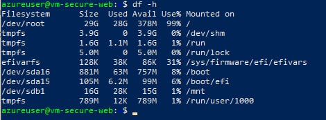
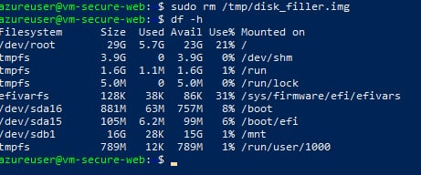
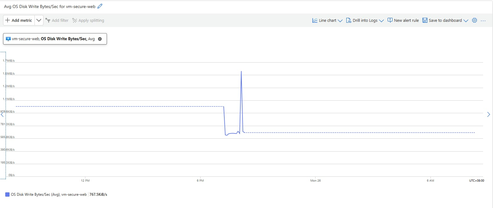

# Project 3: Azure Troubleshooting & Root Cause Analysis (Production Simulation)

## Overview

This project focuses on **troubleshooting, investigation, and root cause analysis (RCA)** — core responsibilities of a Junior Cloud Engineer supporting live environments.

Unlike deployment projects, this project intentionally introduces **failures and misconfigurations** and requires diagnosing issues using Azure-native tools, logs, and systematic thinking.

This simulates real on-call and support scenarios where engineers must restore service quickly and safely.

---

## Objectives

* Practice systematic troubleshooting of Azure infrastructure issues
* Identify root causes using logs, metrics, and configuration review
* Restore service with minimal impact
* Document findings in a professional RCA format

---

## Architecture

**Components Used:**

* Azure Virtual Machine (Linux)
* Azure Virtual Network & Subnet
* Network Security Group (NSG)
* Azure Monitor & Log Analytics

**Scenario Model:**

* Healthy state → Failure introduced → Detection → Diagnosis → Resolution → Validation

---

## Troubleshooting Methodology (Used for All Scenarios)

1. Identify symptoms (what is broken)
2. Check monitoring alerts and metrics
3. Review recent configuration changes
4. Isolate the failing component
5. Apply fix
6. Validate service restoration
7. Document root cause

This structured approach mirrors real production incident handling.

---

## Scenario 1: Web Application Unreachable (NSG Misconfiguration)

### Problem Introduced
Inbound HTTP traffic was blocked by deleting the existing allow rule, simulating a common production misconfiguration where security rules are accidentally removed.

### Symptoms
* **Browser Error:** `52.237.81.46` returned `ERR_CONNECTION_TIMED_OUT`.
* **Resource Status:** Azure Portal confirmed `vm-secure-web` was in a "Running" state.

### Investigation Steps
* **Verified Connectivity:** Confirmed the VM was responsive via the Azure Portal.
* **Network Analysis:** Used **Azure Network Watcher: IP Flow Verify**.
* **Packet Details:** Tested Protocol TCP, Local Port 80, and Remote Port *. The tool confirmed traffic was "Denied" by the NSG.

### Root Cause
The Inbound Security Rule for HTTP (Port 80) was missing from `nsg-secure-web`, causing the default `DenyAllInBound` rule to block all incoming web traffic.

### Resolution
* **Created Rule:** Added a new Inbound Security Rule.
* **Configuration:** Protocol: TCP, Destination Port: 80, Action: Allow, Priority: 100.

### Validation
* **Status:** Website successfully loaded the Nginx "Welcome" page.
* **Tool Confirmation:** Re-ran IP Flow Verify; result changed to "Allowed."

---

## Scenario 2: High Disk Usage Causing Service Failure

### Problem Introduced
* Simulated a storage failure by creating a large 25GB dummy file using the `fallocate` command.
* Targeted the root partition (`/dev/root`) to observe system behavior when storage is near 100% capacity.

### Symptoms
* **System Alert:** The OS reported "No space left on device" during write operations.
* **Storage Status:** CLI check `df -h` showed 99% disk utilization with only 378MB remaining.

 

### Investigation Steps
* **Azure Portal:** Monitored **OS Disk Write Bytes/Sec** in the Metrics blade to identify the exact time of the storage spike.

  * **CLI Analysis:** Connected via SSH and used `df -h` to identify the saturated partition.
* **File Discovery:** Used `ls -lh /tmp` to find the specific file causing the saturation.

### Root Cause
* Insufficient disk space available for application operations and system logging due to a large temporary file (`/tmp/disk_filler.img`).

### Resolution
* **Manual Cleanup:** Reclaimed space by deleting the filler file using `sudo rm /tmp/disk_filler.img`.
* **Preventative Measure:** Real-world resolution would include setting up Azure Monitor Alerts for disk thresholds exceeding 80%.

 

### Validation
* **Space Verification:** Confirmed disk usage returned to a baseline of 14% via `df -h`.
* **Metric Baseline:** Observed the disk write metrics return to idle levels in the Azure Portal.

 

---

## Scenario 3: Access Denied (RBAC Misconfiguration)

### Problem Introduced

User loses access to VM or resource group.

### Symptoms

* Azure Portal shows authorization errors

### Investigation Steps

* Review role assignments at Resource Group and VM level
* Identify missing or incorrect role

### Root Cause

RBAC role removed or incorrectly assigned.

### Resolution

* Reassign correct role (e.g., Virtual Machine Contributor)

### Validation

* Confirm access restored

📸 Screenshot: RBAC role correction

---

## Scenario 4: Monitoring Data Missing (Agent Failure)

### Problem Introduced

Monitoring agent is stopped or uninstalled.

### Symptoms

* No new data in Log Analytics
* Alerts stop triggering

### Investigation Steps

* Check VM extensions
* Review agent status

### Root Cause

Monitoring agent stopped or misconfigured.

### Resolution

* Restart or reinstall monitoring agent

### Validation

* Confirm logs and metrics resume

📸 Screenshot: Log Analytics data restored

---

## Root Cause Analysis (Sample Format)

**Incident:** Web Application Outage

**Impact:** Web service unavailable to users

**Root Cause:** NSG inbound rule misconfiguration blocking HTTP traffic

**Resolution:** Corrected NSG rule allowing TCP port 80

**Prevention:** Implemented configuration review and monitoring alerts

---

## Key Skills Demonstrated

* Incident investigation
* Root cause analysis
* Azure networking and security troubleshooting
* Log and metric analysis
* Service restoration

---

## Resume Bullet (Ready to Use)

> Diagnosed and resolved multiple Azure infrastructure incidents by analyzing logs, metrics, and configuration errors, performing root cause analysis, and restoring service availability.

---

## Lessons Learned

* Small configuration changes can cause major outages
* Monitoring accelerates troubleshooting
* Structured RCA improves response time

---

## Status

🟡 In Progress – Troubleshooting scenarios executed
