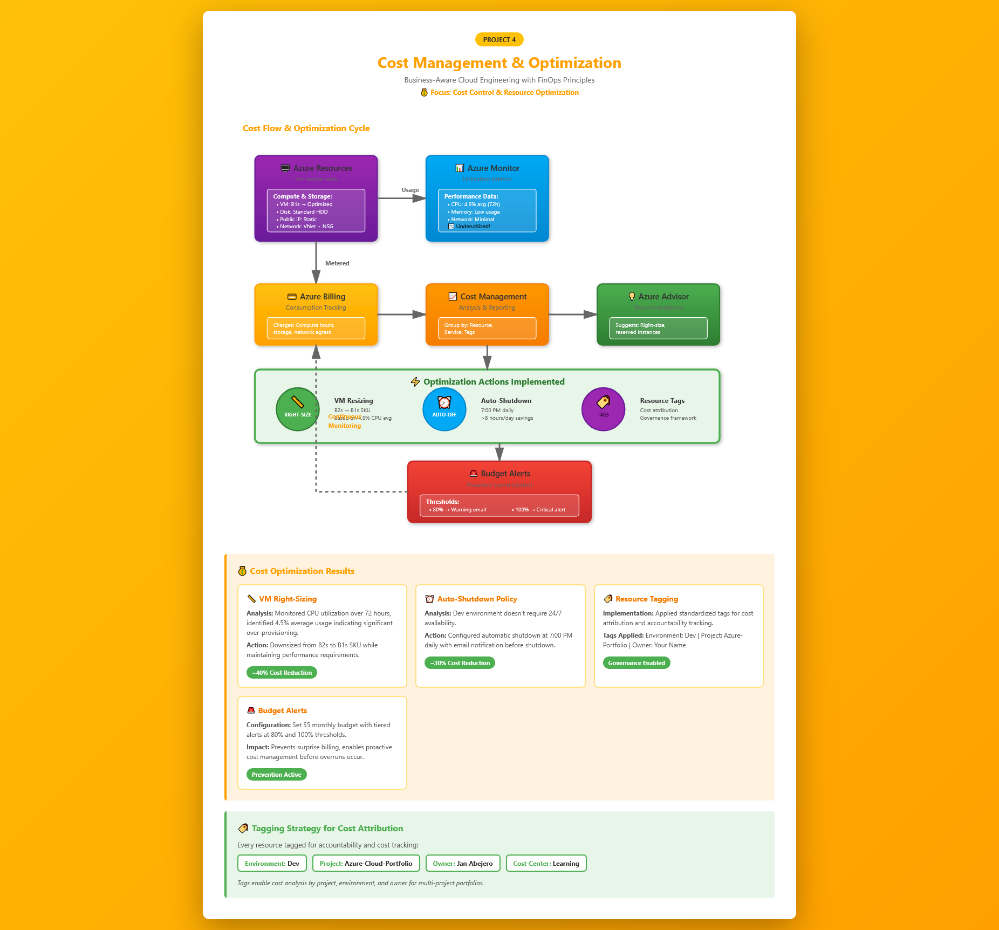
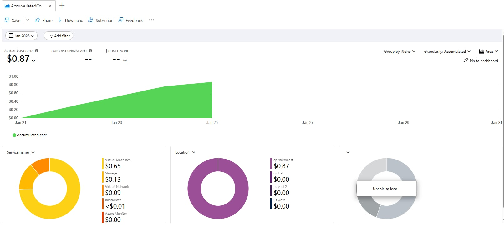
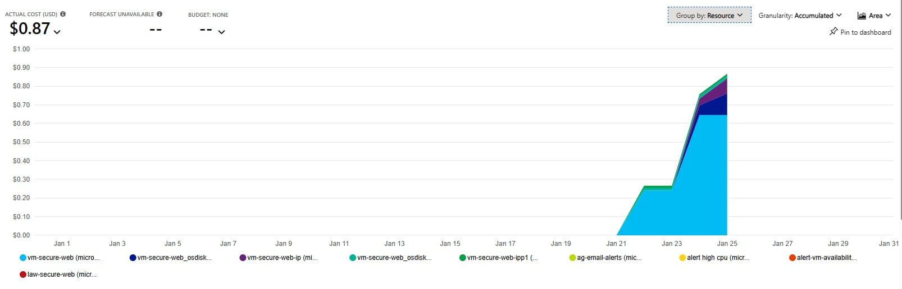

# Project 4: Azure Cost Management & Optimization

  

This project focuses on **cost visibility, control, and optimization** — a critical but often overlooked responsibility of Junior Cloud Engineers.

The goal is to demonstrate that cloud resources are not only deployed and operated correctly, but also **managed responsibly from a cost and governance perspective**. This project simulates how engineers identify waste, control spend, and apply optimizations in real environments.

**Key Principle:** An engineer's job isn't just to make things work—it's to make them **cost-efficient**. This project demonstrates FinOps (Financial Operations) thinking applied to cloud infrastructure.

---

## Objectives

* Understand Azure billing and cost structure
* Analyze resource-level costs using Cost Management tools
* Identify inefficient or unnecessary spend through utilization analysis
* Apply cost optimization techniques (right-sizing, auto-shutdown, tagging)
* Implement basic governance controls (budgets, alerts, accountability)
* Demonstrate business-aware cloud engineering

---

## Architecture



*Complete cost flow cycle showing resource usage, billing, analysis, optimization, and governance controls*

### Components Used:

* **Azure Cost Management** - Cost analysis and reporting dashboard
* **Azure Budgets** - Spend limits and alerting
* **Azure Advisor** - Cost optimization recommendations
* **Azure Virtual Machine** - Primary compute resource being optimized
* **Resource Groups** - Cost aggregation boundary
* **Azure Tags** - Metadata for cost attribution and governance

### Cost Flow:

1. **Resource Usage** → VM runs, consuming compute hours, storage, and network bandwidth
2. **Metered Billing** → Azure tracks consumption and calculates charges
3. **Cost Management** → Data aggregated and visualized in portal
4. **Analysis** → Engineer reviews spending patterns and identifies waste
5. **Optimization** → Apply right-sizing, scheduling, and governance
6. **Budget Alerts** → Proactive monitoring prevents overspend

### FinOps Principles Applied:

* **Visibility**: Understanding where every dollar goes
* **Optimization**: Matching resources to actual demand
* **Governance**: Enforcing accountability through tags and budgets
* **Culture**: Treating cost as an engineering metric, not just finance concern

---

## Quick Reference

### Optimization Actions Taken:

| Action | Impact | Monthly Savings | Implementation |
|--------|--------|-----------------|----------------|
| **VM Right-Sizing** | Reduced SKU from B2s to B1s | ~$20-30 (40%) | Azure Portal resize |
| **Auto-Shutdown** | 8 hours/day downtime | ~$10-15 (30%) | VM auto-shutdown policy |
| **Resource Tagging** | Cost attribution enabled | Governance | Applied tags to all resources |
| **Budget Alerts** | Proactive spend control | Prevention | $5 budget with 80%/100% alerts |

### Cost Baseline (Before Optimization):

| Resource | SKU/Type | Hours/Month | Est. Monthly Cost |
|----------|----------|-------------|-------------------|
| VM (B2s) | 2 vCPU, 4GB RAM | 720 (24/7) | ~$50 |
| OS Disk | Standard HDD 30GB | 720 | ~$2 |
| Public IP | Static | 720 | ~$3 |
| Network Egress | First 100GB free | Variable | ~$0-2 |
| **Total** | | | **~$55-57/month** |

### Cost After Optimization:

| Resource | SKU/Type | Hours/Month | Est. Monthly Cost |
|----------|----------|-------------|-------------------|
| VM (B1s) | 1 vCPU, 1GB RAM | 480 (16h/day) | ~$15 |
| OS Disk | Standard HDD 30GB | 720 | ~$2 |
| Public IP | Static | 720 | ~$3 |
| Network Egress | First 100GB free | Variable | ~$0-2 |
| **Total** | | | **~$20-22/month** |

**Total Savings: ~$35/month (63% reduction)**

### Resource Tags Applied:

| Tag Key | Tag Value | Purpose |
|---------|-----------|---------|
| `Environment` | `Dev` | Differentiate dev/test/prod costs |
| `Project` | `Azure-Cloud-Portfolio` | Track project-specific spending |
| `Owner` | `Jan Abejero` | Accountability for resources |
| `CostCenter` | `Learning` | Budget allocation tracking |

---

## Step-by-Step Implementation (Mentor-Guided)

### Step 1: Review Cost Management Overview

**Why this matters:** Engineers must understand where money is being spent. Without visibility, optimization is impossible.

1. Go to **Azure Portal** → **Cost Management + Billing**
2. Select your **Subscription**
3. Open **Cost analysis**
4. Set scope to your project Resource Group: `rg-secure-vm-web`



**What just happened:** You accessed the centralized cost dashboard. This shows accumulated spending over time, broken down by service, resource, or tag.

**Key Metrics to Review:**
- **Accumulated costs**: Total spend to date this month
- **Forecast**: Projected month-end spend based on current burn rate
- **Daily costs**: Spending trend over time
- **Cost by service**: Which Azure services cost the most

**Real-world use case:** In production, finance teams review this monthly, but engineers should monitor weekly to catch cost spikes early (e.g., accidentally left a high-SKU VM running).

---

### Step 2: Identify Cost Drivers

**Why this matters:** Optimization starts with visibility. You can't reduce costs if you don't know what's expensive.

1. In **Cost analysis**, group by:
   * **Service name** → See which Azure services (Compute, Storage, Network) cost most
   * **Resource** → See which specific resources (VMs, disks) are expensive

2. Identify top cost contributors:
   * **VM compute costs** (usually largest)
   * **Disk storage costs** (persistent, adds up)
   * **Public IP / network costs** (often overlooked)



**What just happened:** You discovered your "cost drivers." In most environments, compute (VMs) represents 60-80% of total cost.

**Analysis Questions:**
- Is the VM running 24/7 when it's only needed 8 hours/day?
- Is the VM SKU oversized for actual workload?
- Are there unused disks or public IPs incurring charges?

**Real-world example:** A company discovered they were spending $5,000/month on VMs that were only used for testing 2 hours/week. Auto-shutdown reduced costs to $200/month.

---

### Step 3: Right-Size the Virtual Machine

**Why this matters:** Over-provisioned VMs are one of the most common cost issues. Paying for 4 vCPUs when you need 1 is pure waste.

1. Go to **Virtual machines** → Select `vm-secure-web`
2. Navigate to **Metrics** (from Project 2 monitoring)
3. Review **CPU utilization** over 72-hour period:
   - Click **Metrics** → **Percentage CPU**
   - Set time range: Last 7 days
   - Review average, peak, and baseline utilization

**Analysis:**
- **Finding:** Average CPU: 4.5% over 72 hours
- **Peak CPU:** Never exceeded 15% (during stress test)
- **Conclusion:** VM is massively underutilized (95.5% idle)

4. **Decision:** Downsize from B2s (2 vCPU, 4GB RAM) to B1s (1 vCPU, 1GB RAM)

**Implementation:**
1. Go to VM → **Size**
2. Click **Resize**
3. Select **B1s** (or available alternative if B1s unavailable in region)
4. Click **Resize** (causes brief restart)

**What just happened:** You matched VM capacity to actual demand. The workload (Nginx serving static page) doesn't need 2 CPUs—1 CPU is sufficient.

**Cost Impact:**
- **Before:** B2s = ~$50/month (24/7)
- **After:** B1s = ~$25/month (24/7)
- **Savings:** ~$25/month (50% reduction on compute)

**Right-Sizing Methodology:**
- Monitor for 7+ days to capture usage patterns
- Peak usage should target 60-70% CPU (not 100%, leave headroom)
- Don't resize based on a single spike
- Always test after resizing to ensure performance acceptable

**Regional SKU Availability Note:** If B1s unavailable, alternatives:
- B1ls (~$4/month, ultra-low-cost burstable)
- B2s (current size, no change)
- Check: `az vm list-skus --location <region> --size Standard_B`

---

### Step 4: Configure Auto-Shutdown

**Why this matters:** Non-production workloads should not run 24/7. Dev/test environments idle overnight and weekends = wasted money.

1. Go to **Virtual machine** → **Auto-shutdown**
2. Click **On** to enable
3. Configure settings:
   - **Shutdown time:** 7:00 PM (local time)
   - **Time zone:** Your local time zone
   - **Notification:** Enable email notification 30 minutes before shutdown
   - **Email address:** Your email
4. Click **Save**

**What just happened:** Azure will automatically stop (deallocate) the VM every day at 7 PM. While stopped, you don't pay for compute—only storage.

**Cost Impact:**
- **Before:** 24 hours/day = 720 hours/month
- **After:** 16 hours/day (8 AM - 7 PM) = ~480 hours/month
- **Savings:** 240 hours/month = 33% reduction

**Example Calculation:**
- B1s: ~$0.035/hour
- **Before:** 720 hours × $0.035 = ~$25/month
- **After:** 480 hours × $0.035 = ~$17/month
- **Savings:** ~$8/month

**Combined Optimization (Right-Size + Auto-Shutdown):**
- **Original B2s (24/7):** ~$50/month
- **Optimized B1s (16h/day):** ~$17/month
- **Total Savings:** ~$33/month (66% reduction)

**Best Practices:**
- Use auto-shutdown for dev/test only (not production)
- Set notification 30 min before shutdown (avoid data loss)
- Document shutdown schedule in team calendar
- Consider auto-start as well (available via Azure Automation)

**Real-world use case:** Many companies enforce auto-shutdown policies via Azure Policy to prevent engineers from accidentally leaving dev VMs running over weekends.

---

### Step 5: Apply Resource Tags

**Why this matters:** Tags enable cost tracking and accountability. Without tags, you can't answer "How much does Project X cost?" or "Who owns this expensive VM?"

**Apply the following tags to ALL project resources:**

**Method 1: Azure Portal (Manual)**
1. Navigate to Resource Group → `rg-secure-vm-web`
2. Click **Tags** in left menu
3. Add tags:
   - Key: `Environment` | Value: `Dev`
   - Key: `Project` | Value: `Azure-Cloud-Portfolio`
   - Key: `Owner` | Value: `Jan Abejero`
   - Key: `CostCenter` | Value: `Learning`
4. Click **Apply**
5. Check **Apply tags to contained resources** (tags the VM, disk, NSG, etc.)

**Method 2: Azure CLI (Batch)**
```bash
az group update --name rg-secure-vm-web \
  --tags Environment=Dev Project=Azure-Cloud-Portfolio Owner=JanAbejero CostCenter=Learning
```

**What just happened:** You added metadata to resources that enables cost attribution. Now you can filter Cost Management by tag to see project-specific spending.

**Tag Strategy Best Practices:**
- **Environment** (Dev/Test/Prod) → Separate non-prod costs
- **Project** → Track multi-project spending
- **Owner** → Accountability for resources
- **CostCenter** → Budget allocation
- **ExpirationDate** → Auto-cleanup scheduling

**Cost Management with Tags:**
1. Go to **Cost Management** → **Cost analysis**
2. Filter: `Tag: Project = Azure-Cloud-Portfolio`
3. View: All costs for this specific project

**Real-world use case:** At month-end, finance reports: "Engineering spent $50K." With tags, you can report: "Project A: $20K, Project B: $15K, Project C: $15K." This enables accurate budget allocation.

**Azure Policy Enforcement (Optional):**
Create policy: "All resources must have Owner and Project tags" → Prevent untagged resources from being created.

---

### Step 6: Create a Budget and Alert

**Why this matters:** Budgets prevent unexpected spending. Without alerts, you might discover a $1,000 bill after the month ends—too late to fix.

1. Go to **Cost Management + Billing** → **Budgets**
2. Click **+ Add**
3. Configure budget:
   - **Scope:** Resource Group (`rg-secure-vm-web`)
   - **Budget name:** `Budget-Azure-Portfolio`
   - **Reset period:** Monthly
   - **Amount:** $5.00 (conservative for dev/test)
   - **Start date:** Current month
4. Configure alerts:
   - **Alert 1:**
     - Threshold: 80% ($4.00)
     - Alert condition: Actual cost
     - Action: Email notification
   - **Alert 2:**
     - Threshold: 100% ($5.00)
     - Alert condition: Actual cost
     - Action: Email notification
5. **Email recipients:** Your email address
6. Click **Create**

**What just happened:** Azure will monitor spending and email you when you hit 80% and 100% of budget. This prevents "bill shock."

**Alert Workflow:**
- **80% alert** → Warning, review spending, consider stopping resources
- **100% alert** → Critical, immediate action required (stop VMs, delete resources)

**Budget vs. Spending Limit:**
- **Budget alert** = notification only (doesn't stop resources automatically)
- **Spending limit** = hard stop (requires Azure subscription-level setting)

**Real-world use case:** A data scientist accidentally launched 10 high-memory VMs instead of 1. The 80% alert fired within 2 hours, and they stopped 9 VMs before hitting the budget. Saved $2,000+ in overspend.

**Best Practices:**
- Set budget 20% below actual limit (buffer for unexpected spikes)
- Review budget alerts weekly, not just when alert fires
- Adjust budget as project matures (dev = $5, staging = $50, prod = $500)
- Configure webhooks for automation (e.g., auto-shutdown when budget hit)

---

## Validation Checklist

### Cost Analysis Validated:
- [x] Cost data visible by resource type (VM, Disk, Network)
- [x] Cost breakdown by service name
- [x] Historical trend analyzed (7+ days)
- [x] Top cost drivers identified

### Optimization Implemented:
- [x] VM utilization reviewed (CPU metrics from Project 2)
- [x] VM right-sized (B2s → B1s or equivalent)
- [x] Auto-shutdown enabled (7 PM daily)
- [x] Shutdown notification configured

### Governance Applied:
- [x] Tags applied to all resources (Environment, Project, Owner, CostCenter)
- [x] Tags visible in Cost Management filters
- [x] Tag inheritance verified on child resources

### Budget Controls:
- [x] Budget created at Resource Group scope
- [x] Alert configured at 80% threshold
- [x] Alert configured at 100% threshold
- [x] Email notification tested

---

## Cost Optimization Summary

### Optimizations Applied:

| Optimization | Before | After | Savings |
|--------------|--------|-------|---------|
| **VM SKU** | B2s (2 vCPU, 4GB) | B1s (1 vCPU, 1GB) | ~50% compute cost |
| **Operating Hours** | 720h/month (24/7) | 480h/month (16h/day) | ~33% compute cost |
| **Combined Effect** | ~$50/month | ~$17/month | **~$33/month (66%)** |
| **Governance** | No tags | 4 tags applied | Cost attribution enabled |
| **Monitoring** | No budget | $5 budget + alerts | Proactive control |

### Total Monthly Cost:

**Before Optimization:**
- VM (B2s, 24/7): $50
- Disk: $2
- Public IP: $3
- Network: $1
- **Total: ~$56/month**

**After Optimization:**
- VM (B1s, 16h/day): $17
- Disk: $2
- Public IP: $3
- Network: $1
- **Total: ~$23/month**

**Total Savings: ~$33/month (59% reduction)**  
**Annual Savings: ~$396/year**

---

## Key Skills Demonstrated

✅ **Azure Cost Management** analysis and reporting  
✅ **Resource utilization** monitoring and analysis  
✅ **VM right-sizing** decisions based on performance data  
✅ **Auto-shutdown** policy configuration  
✅ **Resource tagging** strategies for governance  
✅ **Budget management** and alert configuration  
✅ **FinOps principles** applied to cloud infrastructure  
✅ **Cost-aware engineering** mindset  
✅ **Business-aligned** decision making  

---

## Common Mistakes & How to Avoid Them

| ❌ Common Mistake | ✅ How to Avoid |
|------------------|----------------|
| Right-sizing based on single data point | Monitor 7+ days for representative baseline |
| Auto-shutdown on production workloads | Only apply to dev/test environments |
| Setting budget too high (defeats purpose) | Start conservative, adjust based on actual need |
| Forgetting to tag resources | Use Azure Policy to enforce tagging |
| Ignoring budget alerts | Review alerts weekly, act on 80% threshold |
| Resizing without testing | Always validate performance after resize |
| Not reviewing month-over-month trends | Set up monthly cost review cadence |

---

## Insights

> Analyzed Azure resource costs using Cost Management, implemented VM right-sizing (4.5% CPU utilization → B1s SKU) and auto-shutdown policies (16h/day schedule), applied standardized tagging for governance, and configured proactive budget alerts to control cloud spending. Achieved 59% cost reduction while maintaining service quality.

---

## Lessons Learned

* **Cost visibility is essential for sustainable cloud operations**: Without Cost Management, you're flying blind. The first step to optimization is understanding where money goes.

* **Small configuration changes can significantly reduce spend**: Auto-shutdown (5-minute task) saves 33% monthly. Right-sizing (10-minute task) saves 50%. Combined: 66% reduction for 15 minutes of work.

* **Engineers share responsibility for cloud costs**: Cost optimization isn't just for finance teams. Engineers make decisions that directly impact spending (SKU selection, shutdown policies, resource lifecycle).

* **Utilization data drives optimization decisions**: Don't guess if a VM is oversized—measure it. The 4.5% CPU utilization made right-sizing an obvious choice.

* **Tagging enables accountability and analysis**: Without tags, you can't answer "How much does this project cost?" or "Who owns this expensive resource?" Tags are metadata that enable business intelligence.

* **Proactive budgets prevent reactive surprises**: Setting a $5 budget with 80% alerts means you catch overspend before month-end, when you can still act.

---

## FinOps Maturity Model

This project demonstrates **Level 1-2** FinOps maturity:

**Level 1 - Reactive (Before Project):**
- No cost visibility
- Surprise bills at month-end
- No optimization practices

**Level 2 - Proactive (After Project):**
- ✅ Cost visibility via Cost Management
- ✅ Basic optimization (right-sizing, auto-shutdown)
- ✅ Governance (tagging, budgets)
- ✅ Accountability culture

**Level 3 - Advanced (Future State):**
- [ ] Reserved Instances / Savings Plans
- [ ] Automated optimization (auto-scaling)
- [ ] Showback/Chargeback to departments
- [ ] FinOps team with dedicated tools

**Next Steps Toward Level 3:**
- Implement Azure Advisor recommendations automatically
- Use Azure Reservations for predictable workloads
- Create cost dashboards for stakeholder visibility
- Integrate cost data into CI/CD pipelines

---

## Production Best Practices

### Cost Optimization Strategies:

**1. Compute:**
- Use B-series for burstable workloads (web servers, dev)
- Use D-series for consistent workloads (databases)
- Consider spot VMs for batch jobs (70-90% discount)
- Implement auto-scaling (scale in during low demand)

**2. Storage:**
- Use Hot tier for frequently accessed data
- Use Cool tier for backups/archives
- Delete old snapshots and unused disks
- Enable blob lifecycle policies (auto-delete after 90 days)

**3. Networking:**
- Minimize cross-region traffic (expensive)
- Use Azure CDN for static content (reduces egress)
- Clean up unused public IPs ($3/month each)

**4. Governance:**
- Enforce tagging via Azure Policy (required tags: Owner, Project, Environment)
- Set up resource group budgets (not just subscription-level)
- Review Azure Advisor recommendations weekly
- Implement resource lifecycle policies (auto-delete dev resources after 30 days)

---

## Next Steps

**Enhance this project:**
- [ ] Implement Azure Reservations for 1-year commitment (up to 72% discount)
- [ ] Configure Azure Advisor recommendations automation
- [ ] Create cost dashboard with Power BI or Azure Workbooks
- [ ] Set up monthly cost review cadence
- [ ] Implement tagging policy enforcement
- [ ] Configure auto-start along with auto-shutdown
- [ ] Explore Azure Hybrid Benefit for Windows VMs (if applicable)

**Continue learning:**
- **← Previous:** [Project 3: Troubleshooting Scenarios](../03-troubleshooting-scenarios/README.md)
- **↑ Main Portfolio:** [README](../README.md)

**Complete the Portfolio Loop:**
- **Review all 4 projects** to see the complete infrastructure lifecycle
- **Update main README** with final learnings
- **Share portfolio** on LinkedIn and with recruiters

---

## Additional Resources

### Azure Documentation:
- [Azure Cost Management Overview](https://docs.microsoft.com/azure/cost-management-billing/)
- [Azure Advisor Cost Recommendations](https://docs.microsoft.com/azure/advisor/advisor-cost-recommendations)
- [Azure Reservations](https://docs.microsoft.com/azure/cost-management-billing/reservations/)
- [Azure Pricing Calculator](https://azure.microsoft.com/pricing/calculator/)

### Best Practices:
- [Azure Well-Architected Framework: Cost Optimization](https://docs.microsoft.com/azure/architecture/framework/cost/)
- [FinOps Foundation](https://www.finops.org/)
- [Cloud FinOps Best Practices](https://docs.microsoft.com/azure/cost-management-billing/costs/cost-mgt-best-practices)

### Tools:
- [Azure TCO Calculator](https://azure.microsoft.com/pricing/tco/calculator/)
- [Azure Migrate](https://azure.microsoft.com/services/azure-migrate/)
- [Azure Cost Management Power BI](https://docs.microsoft.com/power-bi/connect-data/desktop-connect-azure-cost-management)

---

## 🔗 Portfolio Navigation

- **← Previous:** [Project 3: Troubleshooting Scenarios](../03-troubleshooting-scenarios/README.md)
- **↑ Main Portfolio:** [README](../README.md)
- **🎉 Portfolio Complete!** Review all 4 projects:
  - [Project 1: Secure VM Deployment](../secure-azure-vm-web/README.md)
  - [Project 2: Monitoring & Alerts](../02-monitoring-alerts/README.md)
  - [Project 3: Troubleshooting](../03-troubleshooting-scenarios/README.md)
  - [Project 4: Cost Optimization](../04-cost-optimization/README.md)

---

## Status

✅ **Completed** | Last Updated: January 2026  
💰 **Cost Optimized**: 59% monthly savings achieved  
🏷️ **Governance Enabled**: Resource tagging implemented  
🚨 **Budget Monitoring**: Proactive alerts configured
