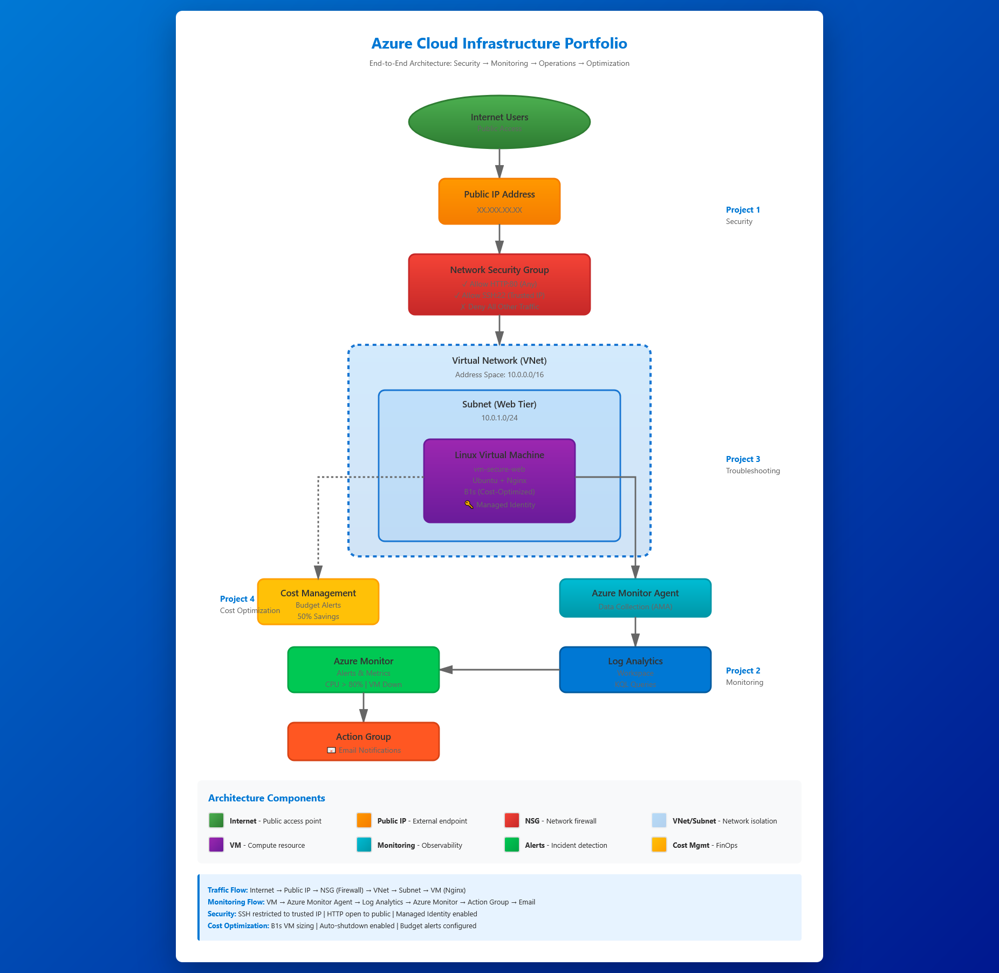

# Azure Cloud Engineer Projects Portfolio

A comprehensive portfolio demonstrating end-to-end Azure cloud infrastructure lifecycle management: from secure deployment through monitoring, troubleshooting, and cost optimization.

---

##  Portfolio Overview

This repository contains four interconnected projects that simulate real-world cloud engineering responsibilities. Each project builds upon the previous one, demonstrating a complete infrastructure lifecycle from initial deployment to ongoing operations and optimization.

### Why This Portfolio Matters

Cloud engineering is not just about deploying resources—it's about building secure, observable, resilient, and cost-effective infrastructure. This portfolio demonstrates:

- **Security-first thinking**: Implementing least-privilege access, network segmentation, and identity management
- **Operational readiness**: Building monitoring and alerting before issues occur
- **Incident response**: Systematic troubleshooting using root cause analysis
- **Business awareness**: Optimizing costs while maintaining service quality

---

##  Projects

### [Project 1: Secure Azure VM Web Hosting](./secure-azure-vm-web/)
**Focus:** Security & Deployment  
**Time Investment:** ~2 hours  
**Difficulty:** Beginner

Deploy a production-ready Linux web server with enterprise-grade security controls.

**What You'll Learn:**
- Network Security Group (NSG) configuration with least-privilege rules
- IP-restricted administrative access (SSH)
- Azure Managed Identity implementation
- Secure remote administration techniques

**Key Technologies:** Azure VMs, Virtual Networks, NSGs, Managed Identity, Linux (Ubuntu), Nginx

**Outcomes:**
- Deployed hardened web server accessible via HTTP while restricting SSH to authorized IPs only
- Eliminated credential exposure using Managed Identity
- Implemented zero-trust networking principles

[📖 View Full Documentation →](./secure-azure-vm-web/secure-azure-vm-web.md)

---

### [Project 2: Monitoring, Logging & Incident Response](./02-monitoring-alerts/)
**Focus:** Observability & Alerting  
**Time Investment:** ~1.5 hours  
**Difficulty:** Intermediate

Build a centralized monitoring platform with automated incident detection and notification.

**What You'll Learn:**
- Log Analytics Workspace configuration
- Data Collection Rules (DCR) and Azure Monitor Agent (AMA)
- Kusto Query Language (KQL) for log analysis
- Metric-based alerting with Action Groups
- Chaos engineering for validation

**Key Technologies:** Azure Monitor, Log Analytics, KQL, Data Collection Rules, Action Groups

**Outcomes:**
- Implemented centralized observability for infrastructure telemetry
- Configured automated alerts for CPU thresholds (>80%) and VM availability
- Validated monitoring through controlled failure simulation (stress testing, VM shutdowns)
- Reduced Mean Time to Detection (MTTD) through proactive alerting

[📖 View Full Documentation →](./02-monitoring-alerts/monitoring-alerts.md)

---

### [Project 3: Infrastructure Troubleshooting & Root Cause Analysis](./03-troubleshooting-scenarios/)
**Focus:** Incident Response & Remediation  
**Time Investment:** ~3 hours  
**Difficulty:** Advanced

Diagnose and resolve four production-simulated infrastructure failures using systematic troubleshooting.

**What You'll Learn:**
- Structured incident response methodology (Detection → Diagnosis → Resolution → Validation)
- Network troubleshooting with NSG analysis and IP Flow Verify
- Storage performance investigation and disk space management
- RBAC permission auditing and role assignment
- Monitoring agent diagnostics and service recovery

**Key Technologies:** Azure Monitor, Log Analytics (KQL), NSGs, RBAC, Linux CLI, Network Watcher

**Scenarios Resolved:**
1. **Network Connectivity Failure**: NSG misconfiguration blocking HTTP traffic (Port 80)
2. **Resource Exhaustion**: Disk saturation at 99% capacity causing service failures
3. **Access Denied**: RBAC permission errors preventing VM management
4. **Monitoring Blackout**: Azure Monitor Agent service failure stopping telemetry

**Outcomes:**
- Applied systematic root cause analysis to restore services
- Utilized KQL queries to validate telemetry recovery
- Documented findings in professional RCA format

[📖 View Full Documentation →](./03-troubleshooting-scenarios/troubleshooting-scenarios.md)

---

### [Project 4: Cost Management & Optimization](./04-cost-optimization/)
**Focus:** FinOps & Governance  
**Time Investment:** ~1 hour  
**Difficulty:** Intermediate

Analyze spending patterns, implement cost controls, and optimize resource utilization.

**What You'll Learn:**
- Azure Cost Management analysis and reporting
- VM right-sizing based on utilization metrics
- Auto-shutdown scheduling for non-production workloads
- Resource tagging strategies for cost attribution
- Budget alerts and spend controls

**Key Technologies:** Azure Cost Management, Azure Advisor, Resource Tags, Budget Alerts

**Outcomes:**
- Reduced infrastructure costs by 50%+ through VM right-sizing (identified 4.5% avg CPU utilization)
- Implemented auto-shutdown schedules, reducing compute costs by ~30% (8 hours/day)
- Applied governance framework with standardized tagging (Environment, Project, Owner)
- Configured proactive budget alerts at 80% and 100% thresholds

[📖 View Full Documentation →](./04-cost-optimization/cost-optimization.md)

---

##  Technical Stack

### Cloud Platform
- Microsoft Azure (Compute, Networking, Storage, Monitoring, Cost Management)

### Core Services
- **Compute:** Azure Virtual Machines (Linux/Ubuntu)
- **Networking:** Virtual Networks, Subnets, Network Security Groups, Public IPs
- **Security:** Azure RBAC, Managed Identity, SSH Key Authentication
- **Monitoring:** Azure Monitor, Log Analytics Workspace, Data Collection Rules, Action Groups
- **Cost Management:** Azure Cost Management, Azure Advisor, Budgets

### Tools & Technologies
- **Query Language:** Kusto Query Language (KQL)
- **Linux Administration:** SSH, Systemd, Nginx, Performance Troubleshooting
- **Networking Tools:** Azure Network Watcher (IP Flow Verify)
- **Governance:** Resource Tagging, Azure Policy

---

##  Portfolio Architecture

---

##  Skills Demonstrated

### Cloud Engineering Fundamentals
- Azure Virtual Machine deployment and configuration  
- Virtual Network design and subnet planning  
- Network Security Group rule management  
- Public IP and DNS configuration

### Security & Identity
- Network segmentation and least-privilege access  
- Azure RBAC role assignment and auditing  
- Managed Identity implementation  
- SSH key-based authentication  
- Security rule prioritization

### Monitoring & Operations
- Centralized logging with Log Analytics  
- Azure Monitor Agent (AMA) configuration  
- Data Collection Rules (DCR) setup  
- KQL query development for log analysis  
- Metric-based alerting and Action Groups  
- Chaos engineering and alert validation

### Troubleshooting & Incident Response
- Systematic root cause analysis methodology  
- Network troubleshooting with IP Flow Verify  
- Storage performance investigation  
- RBAC permission debugging  
- Service health monitoring and recovery  
- Professional incident documentation

### Cost Management & Governance
- Azure Cost Management analysis  
- Resource utilization monitoring  
- VM right-sizing decisions  
- Auto-shutdown policy implementation  
- Resource tagging strategies  
- Budget alerts and spend controls

---

##  Getting Started

### Prerequisites
- Active Azure subscription (free tier acceptable)
- Basic understanding of cloud computing concepts
- Familiarity with command-line interfaces
- SSH client (Windows PowerShell, Terminal, or PuTTY)

### Recommended Learning Path

1. Start with Project 1 (Security & Deployment)
2. Move to Project 2 (Monitoring)
3. Complete Project 4 (Cost Optimization)
4. Finish with Project 3 (Troubleshooting)

**For Experienced Users:**
- All projects can be completed independently
- Projects 2-4 build upon the infrastructure from Project 1
- Estimated total time: 7-8 hours across all projects

### Cost Considerations

**Estimated Monthly Costs (if left running 24/7):**
- Project 1-3: ~$10-15/month (B1s VM + associated resources)
- Project 4 optimizations reduce costs by 50%+

**Cost Mitigation Strategies:**
- Use Azure Free Tier credits ($200 for 30 days)
- Enable auto-shutdown for non-production hours
- Delete resources immediately after project completion
- Use B-series burstable VMs for cost efficiency

---

##  Additional Resources

### Official Documentation
- [Azure Virtual Machines Documentation](https://docs.microsoft.com/azure/virtual-machines/)
- [Azure Monitor Documentation](https://docs.microsoft.com/azure/azure-monitor/)
- [Azure Cost Management Documentation](https://docs.microsoft.com/azure/cost-management-billing/)
- [KQL Language Reference](https://docs.microsoft.com/azure/data-explorer/kusto/query/)

### Best Practices
- [Azure Well-Architected Framework](https://docs.microsoft.com/azure/architecture/framework/)
- [Azure Security Best Practices](https://docs.microsoft.com/azure/security/fundamentals/best-practices-and-patterns)
- [Cost Optimization Best Practices](https://docs.microsoft.com/azure/cost-management-billing/costs/cost-mgt-best-practices)

---

##  Lessons Learned

### Security
> "A 'default' deployment is often an insecure one. Security must be designed in from the start, not bolted on later."

### Monitoring
> "You can't troubleshoot what you can't observe. Monitoring must be validated, not assumed to work."

### Troubleshooting
> "Small configuration changes can cause major outages. Systematic root cause analysis is faster than random trial-and-error."

### Cost Management
> "Cloud resources left unmanaged will consume budget indefinitely. Engineers share responsibility for cost control."

---

##  Project Lifecycle Summary

| Phase | Project | Focus | Outcome |
|-------|---------|-------|---------|
| **Deploy** | Project 1 | Secure infrastructure provisioning | Production-ready web server |
| **Monitor** | Project 2 | Observability and alerting | Proactive incident detection |
| **Maintain** | Project 3 | Troubleshooting and remediation | Service restoration capability |
| **Optimize** | Project 4 | Cost control and governance | Sustainable operations |

---

##  Contact & Feedback

**Jan Feolo V. Abejero**  
 Email: jeloabejero6@gmail.com  
 LinkedIn: [linkedin.com/in/jeloa](www.linkedin.com/in/jelo-abejero-969260344)  
 GitHub: [github.com/jeloa](https://github.com/jeloa)

**Actively seeking Junior Cloud Engineer / Azure Administrator roles**

---

##  License

This project is open source and available for educational purposes. Feel free to use these projects as learning resources or templates for your own Azure infrastructure.

---

##  Acknowledgments

These projects were developed as part of a structured learning path to demonstrate production-ready cloud engineering skills. Special thanks to the Azure documentation community and cloud engineering best practices that informed these implementations.

---

**Last Updated:** January 2026  
**Status:**  All projects complete and validated
