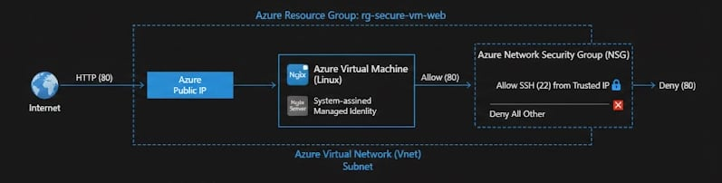

# Project 1: Secure Azure VM Hosting a Web Application (Azure)

## Overview

This project demonstrates the deployment of a **secure, production-style Azure Virtual Machine** hosting a web application. The focus is not just on provisioning compute, but on **security, identity, and operational best practices** expected from a Junior Cloud Engineer in a real-world environment.

The environment is intentionally designed to mirror how cloud resources are deployed and secured in professional settings.

---

## Objectives

* Deploy an Azure Virtual Machine to host a web application
* Secure network access using Network Security Groups (NSGs)
* Enforce least-privilege access principles
* Enable Managed Identity to avoid hardcoded credentials
* Validate public access while maintaining security controls

---

## Architecture

**Components Used:**

* Azure Resource Group
* Azure Virtual Network (VNet)
* Subnet
* Network Security Group (NSG)
* Azure Virtual Machine (Linux)
* Public IP Address
* Managed Identity
* Nginx Web Server

**Traffic Flow:**

* Internet → Public IP → NSG → VM (HTTP 80)
* Administrative access (SSH) restricted to trusted IP only



---

## Step-by-Step Implementation

### 1. Create a Resource Group

* Region: Choose a nearby Azure region (e.g., Southeast Asia)
* Naming convention: `rg-secure-vm-web`

### 2. Configure Networking

* Create a Virtual Network: `vnet-secure-web`
* Address space: `10.0.0.0/16`
* Subnet: `subnet-web (10.0.1.0/24)`

### 3. Create Network Security Group (NSG)

**Inbound Rules:**

* Allow HTTP (Port 80) from Internet
* Allow SSH (Port 22) **only from your public IP**
* Deny all other inbound traffic (default)

**Outbound Rules:**

* Default Azure outbound rules

*(Insert NSG Rules Screenshot Here)*

### 4. Deploy the Virtual Machine

* OS: Linux (Ubuntu LTS)
* Size: B1s (cost-efficient)
* Authentication: SSH Key (no password login)
* Public IP: Enabled
* Attach NSG to VM network interface

*(Insert VM Overview Screenshot Here)*

### 5. Enable Managed Identity

* Enable **System-assigned Managed Identity** on the VM
* No secrets or credentials stored in code or configuration

*(Insert Managed Identity Screenshot Here)*

### 6. Install and Configure Web Server

SSH into the VM and run:

```bash
sudo apt update
sudo apt install -y nginx
sudo systemctl enable nginx
sudo systemctl start nginx
```

Verify the default Nginx page loads via the VM public IP.

*(Insert Web Page Screenshot Here)*

---

## Security Considerations

* SSH access restricted to a trusted IP
* Password authentication disabled
* Least-privilege network access enforced via NSG
* Managed Identity enabled to prevent credential exposure

---

## Validation & Testing

* Confirm HTTP access from browser
* Confirm SSH access only from allowed IP
* Verify denied access from unauthorized IPs
* Validate Managed Identity status on VM

---

## Cost Awareness

* VM uses low-cost SKU (B1s)
* Resources deployed only when needed
* All resources removed after testing

---

## Cleanup

To avoid unnecessary charges:

* Delete the Resource Group `rg-secure-vm-web`

---

## Key Skills Demonstrated

* Azure Virtual Machine deployment
* Network Security Group configuration
* Secure remote access (SSH)
* Managed Identity implementation
* Cloud security best practices

---

## Insights

> Deployed and secured a public-facing Azure VM hosting a web application using Network Security Groups, restricted administrative access, and managed identities following least-privilege principles.

---

## Lessons Learned

* Importance of restricting administrative access
* Value of Managed Identity over static credentials
* Real-world implications of exposed cloud resources

---

## Status

 Completed 

