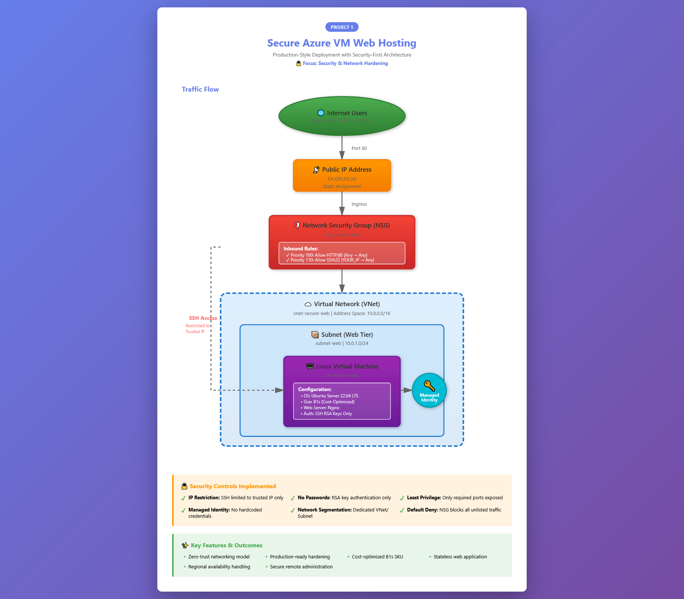
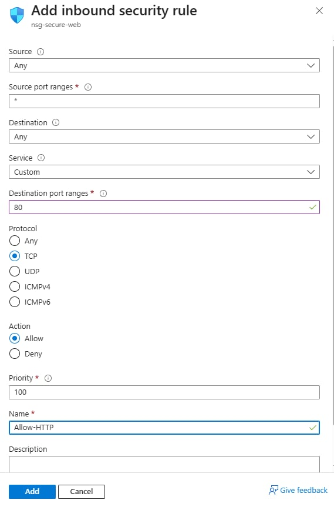
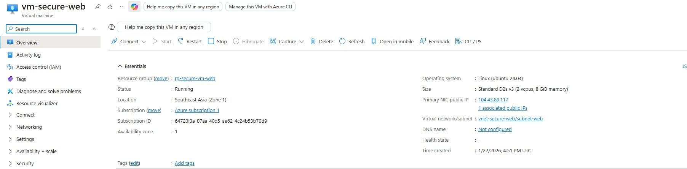
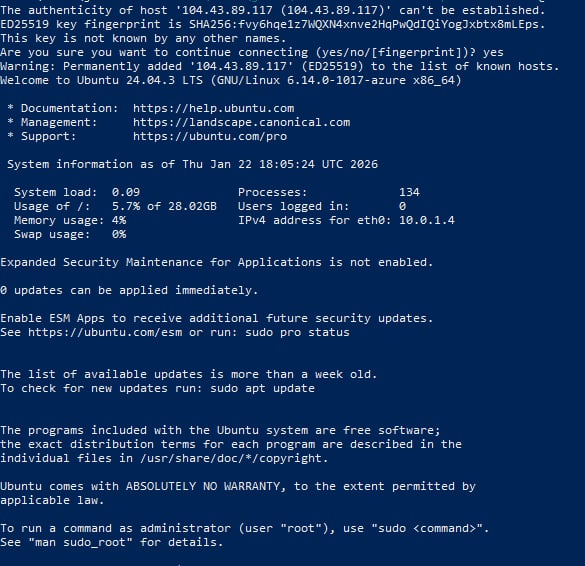
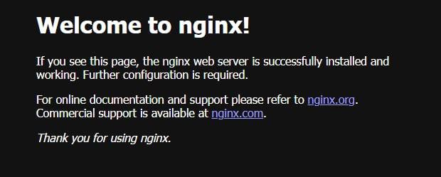

# Project 1: Secure Azure VM Hosting a Web Application

  

## Overview

This project demonstrates the deployment of a **secure, production-style Azure Virtual Machine** hosting a web application. The focus is not just on provisioning compute, but on **security, identity, and operational best practices** expected from a Junior Cloud Engineer in a real-world environment.

The environment is intentionally designed to mirror how cloud resources are deployed and secured in professional settings.

---

## Objectives

* Deploy an Azure Virtual Machine to host a web application
* Secure network access using Network Security Groups (NSGs)
* Enforce least-privilege access principles
* Enable Managed Identity to avoid hardcoded credentials
* Validate public access while maintaining security controls

---

## Architecture



*Complete infrastructure diagram showing security layers, network flow, and component relationships*

### Components Used:

* **Azure Resource Group** - Logical container for all project resources
* **Azure Virtual Network (VNet)** - Isolated network environment (10.0.0.0/16)
* **Subnet** - Web tier subnet for VM placement (10.0.1.0/24)
* **Network Security Group (NSG)** - Network-level firewall with rule-based access control
* **Azure Virtual Machine (Linux)** - Ubuntu Server hosting the web application
* **Public IP Address** - Static external endpoint for web access
* **Managed Identity** - Azure AD identity for credential-free authentication
* **Nginx Web Server** - Production-grade web server

### Traffic Flow:

1. **Internet Users** → Access via Public IP (HTTP Port 80)
2. **Public IP** → Routes traffic to Network Security Group
3. **NSG (Firewall)** → Inspects and filters traffic:
   - ✅ Allows HTTP (Port 80) from anywhere
   - ✅ Allows SSH (Port 22) from trusted IP only
   - ❌ Denies all other traffic
4. **Virtual Network** → Isolated network boundary
5. **Subnet** → Web tier with VM
6. **VM** → Serves web application via Nginx

### Security Model:

* **Zero-trust networking**: All traffic denied by default, explicit allow rules only
* **Least-privilege access**: SSH restricted to single trusted IP address
* **No credential exposure**: Managed Identity eliminates stored secrets
* **Defense in depth**: Multiple security layers (NSG, SSH keys, network isolation)

---

## Quick Reference

### Resources Created:
| Resource Type | Name | Configuration |
|--------------|------|---------------|
| Resource Group | `rg-secure-vm-web` | Container for all resources |
| Virtual Network | `vnet-secure-web` | 10.0.0.0/16 |
| Subnet | `subnet-web` | 10.0.1.0/24 |
| Network Security Group | `nsg-secure-web` | 2 inbound rules (HTTP, SSH) |
| Virtual Machine | `vm-secure-web` | Ubuntu LTS, B1s SKU |
| Public IP | (Dynamic assignment) | Static allocation |

### Security Configuration:
* **SSH Access**: Restricted to YOUR_IP only
* **HTTP Access**: Open to 0.0.0.0/0 (public web traffic)
* **Authentication**: RSA key-based only (no passwords)
* **Identity**: System-assigned Managed Identity enabled

### Estimated Cost:
* **~$10-15/month** if running 24/7
* **Can be reduced to ~$5-7/month** with auto-shutdown (8 hours/day)
* **Free Tier**: May be partially covered by Azure free credits

---

## Step-by-Step Implementation (Mentor-Guided)

This section walks you through the deployment **as if you were on the job**, explaining not just *what* to do, but *why* it is done this way.

---

### Step 1: Create a Resource Group

**Why this matters:** Resource Groups act as logical containers. In real environments, deleting a project cleanly is critical.

1. Go to **Azure Portal** → **Resource groups** → **Create**
2. Configure:
   * Subscription: Your active subscription
   * Resource Group Name: `rg-secure-vm-web`
   * Region: Choose the closest region to you (e.g., Southeast Asia)
3. Click **Review + Create** → **Create**

**What just happened:** You created a management boundary. All resources in this project will live here, making cleanup as simple as deleting one resource group.

---

### Step 2: Create the Virtual Network (VNet)

**Why this matters:** Every production VM lives inside a controlled network.

1. Go to **Virtual networks** → **Create**
2. Basics:
   * Name: `vnet-secure-web`
   * Region: Same as Resource Group
3. IP Addresses:
   * Address space: `10.0.0.0/16`
   * Subnet name: `subnet-web`
   * Subnet range: `10.0.1.0/24`
4. Leave other settings as default
5. Review + Create → Create

**What just happened:** You created an isolated network space. The /16 address space gives you 65,536 IP addresses. The subnet is where your VM will actually live.

---

### Step 3: Create the Network Security Group (NSG)

**Why this matters:** NSGs act as firewalls. This is where most cloud security mistakes happen.

1. Go to **Network Security Groups** → **Create**
2. Configure:
   * Name: `nsg-secure-web`
   * Resource Group: `rg-secure-vm-web`
   * Region: Same region
3. After creation, go to **Inbound security rules**

4. **Add rule to allow HTTP:**
   * Source: Any
   * Source port ranges: *
   * Destination: Any
   * Destination port ranges: 80
   * Protocol: TCP
   * Action: Allow
   * Priority: 100
   * Name: `Allow-HTTP`



5. **Add rule to allow SSH (restricted):**
   * Source: IP Addresses
   * Source IP: *Your public IP*
   * Destination port: 22
   * Protocol: TCP
   * Action: Allow
   * Priority: 110
   * Name: `Allow-SSH-MyIP`


**What just happened:** You created a network firewall with two explicit allow rules. Notice the priorities: lower numbers are evaluated first. The default "DenyAllInbound" rule (priority 65500) blocks everything else.

**Security Note:** Never use `0.0.0.0/0` (anywhere) for SSH source. Always restrict to your specific IP or corporate VPN range.

---

### Step 4: Deploy the Virtual Machine

**Why this matters:** VM configuration reflects cost, security, and performance decisions.

1. Go to **Virtual Machines** → **Create** → Azure virtual machine
2. Basics:
   * Name: `vm-secure-web`
   * Image: Ubuntu Server LTS
   * Size: B1s (cost-efficient for testing) - select an alternative available size if B1s is unavailable in your region
   * Authentication type: SSH public key
   * Username: `azureuser`
3. Networking:
   * Virtual network: `vnet-secure-web`
   * Subnet: `subnet-web`
   * Public IP: Create new
   * NIC network security group: Advanced
   * Configure NSG: `nsg-secure-web`
4. Leave remaining settings as default
5. Review + Create → Create



**What just happened:** You deployed a Linux VM with SSH key authentication (no passwords allowed). The VM is attached to your secured network and NSG. Azure generated an RSA key pair for you.

**Cost Note:** B1s is ~$10/month. If unavailable, B1ls (~$4/month) or B2s (~$40/month but more powerful) are alternatives.

---

### Step 5: Enable Managed Identity

**Why this matters:** Managed Identity removes the need for stored credentials.

1. Go to the VM → **Identity**
2. System-assigned → Toggle **On**
3. Click **Save**

**What just happened:** Azure created an identity in Azure AD for your VM. This identity can be granted permissions to other Azure resources without ever storing credentials on the VM itself.

**Real-world use case:** If this VM needed to access Azure Key Vault, you'd grant the Managed Identity "Get Secret" permission instead of storing a connection string on the VM.

---

### Step 6: Connect to the VM Securely (SSH)

**Why this matters:** Secure administration is a real operational task.

**Option A: Direct SSH (Linux/Mac/Cloud Shell)**
```bash
ssh azureuser@<VM-PUBLIC-IP>
```

**Option B: Windows PowerShell (Recommended Alternative)**

If you are working from a Windows local machine, you can connect directly using PowerShell by pointing to your specific `.pem` key file:

1. Open PowerShell on your computer.
2. Run the following command (replace the path with your actual file location):
   ```powershell
   ssh -i "C:\path\to\your\private-key.pem" azureuser@<VM-PUBLIC-IP>
   ```
3. When prompted with the authenticity warning, type `yes` to establish the connection.

**Note:** You should be able to connect **only from your allowed IP** as configured in your Network Security Group.



**What just happened:** You authenticated using your private key. Azure verified it against the public key stored during VM creation. No passwords were transmitted.

**Troubleshooting:**
- **"Permission denied"** → Wrong key or key permissions too open (run `chmod 600 key.pem` on Linux/Mac)
- **"Connection timeout"** → Check NSG rules, verify your current public IP
- **"Host key verification failed"** → Known_hosts mismatch, delete old entry

---

### Step 7: Install and Configure Nginx Web Server

**Why this matters:** This simulates hosting a real workload.

```bash
sudo apt update
sudo apt install -y nginx
sudo systemctl enable nginx
sudo systemctl start nginx
```

**Command breakdown:**
- `apt update` → Refreshes package lists
- `apt install -y nginx` → Installs web server (auto-confirms with -y)
- `systemctl enable` → Configures auto-start on boot
- `systemctl start` → Starts the service immediately

Open a browser and navigate to:
```
http://<VM-PUBLIC-IP>
```

You should see the Nginx welcome page:



**What just happened:** Nginx is now listening on port 80. The NSG allows inbound traffic on port 80, so the web page is publicly accessible.

---

## Security Considerations

| Security Control | Implementation | Purpose |
|-----------------|----------------|---------|
| **Network Segmentation** | VNet with dedicated subnet | Isolates VM from other networks |
| **Firewall Rules** | NSG with explicit allow rules | Default-deny posture |
| **Administrative Access** | SSH restricted to trusted IP | Prevents brute-force attacks |
| **Authentication** | RSA key-based only | Eliminates password vulnerabilities |
| **Identity Management** | Managed Identity enabled | Removes credential storage risks |
| **Least Privilege** | Only HTTP and SSH exposed | Minimizes attack surface |

---

## Validation & Testing

### ✅ Functional Tests:
- [ ] HTTP access works from any browser (`http://<VM-PUBLIC-IP>`)
- [ ] SSH access works from your allowed IP
- [ ] SSH access **fails** from unauthorized IP (test with phone hotspot)
- [ ] Nginx service is active (`systemctl status nginx`)
- [ ] Managed Identity shows "Enabled" in Azure Portal

### 🔒 Security Tests:
- [ ] Port scan shows only 22 and 80 open (use `nmap` or online tool)
- [ ] Cannot SSH using password authentication
- [ ] VM cannot be accessed via RDP (port 3389 should be closed)

---

## Cost Awareness

| Resource | Estimated Monthly Cost |
|----------|----------------------|
| B1s VM (24/7) | ~$10.00 |
| Standard HDD Disk | ~$2.00 |
| Public IP (Static) | ~$3.00 |
| Network Egress | ~$0.50 |
| **Total** | **~$15.50/month** |

**Cost Optimization Tips:**
- Enable auto-shutdown (reduces to ~$7/month)
- Use B1ls SKU if available (~$4/month)
- Delete when not in use
- Use Azure Free Tier credits if eligible

---

## Cleanup

To avoid unnecessary charges:

```bash
# Via Azure CLI (fastest)
az group delete --name rg-secure-vm-web --yes --no-wait

# Via Azure Portal
1. Go to Resource Groups
2. Select rg-secure-vm-web
3. Click "Delete resource group"
4. Type the name to confirm
5. Click Delete
```

**What gets deleted:** VM, disk, VNet, NSG, public IP, and all associated resources. One command, clean slate.

---

## Key Skills Demonstrated

✅ Azure Virtual Machine deployment and configuration  
✅ Virtual Network design and subnet planning  
✅ Network Security Group rule management with priority-based filtering  
✅ Secure remote access via SSH key authentication  
✅ Managed Identity implementation for credential-free operations  
✅ Cloud security best practices (least privilege, defense in depth)  
✅ Linux system administration (package management, service control)  
✅ Cost-aware resource provisioning  

---

## Common Mistakes & How to Avoid Them

| ❌ Common Mistake | ✅ How to Avoid |
|------------------|----------------|
| SSH open to 0.0.0.0/0 | Always restrict to specific IP |
| Using password auth | Use SSH keys only |
| Forgetting to enable Nginx | Use `systemctl enable` for auto-start |
| Wrong NSG priority | Lower number = higher priority |
| Leaving VM running | Set up auto-shutdown or delete when done |

---

## Insights

> Deployed and secured a public-facing Azure VM hosting a web application using Network Security Groups, restricted administrative access, and managed identities following least-privilege principles. Demonstrated understanding of defense-in-depth security model and cost-aware resource provisioning.

---

## Lessons Learned

* **Security by design, not afterthought**: NSG rules must be configured before exposing the VM, not after.
* **Importance of restricting administrative access**: SSH open to the internet is the #1 vector for cloud VM compromises.
* **Value of Managed Identity over static credentials**: Eliminates entire class of credential leakage vulnerabilities.
* **Real-world implications of exposed cloud resources**: Every publicly accessible resource is being scanned within minutes of creation.
* **Cost awareness is operational awareness**: Even "small" VMs add up over time without proper lifecycle management.

---

## Next Steps

**Enhance this project:**
- [ ] Implement HTTPS with Let's Encrypt SSL certificate
- [ ] Add custom domain with Azure DNS
- [ ] Configure Azure Backup for disaster recovery
- [ ] Implement Azure Monitor alerts for VM availability
- [ ] Deploy behind Azure Application Gateway for load balancing

**Continue learning:**
- **→ Project 2:** [Monitoring, Logging & Incident Response](../02-monitoring-alerts/README.md) - Build observability for this infrastructure
- **→ Project 3:** [Troubleshooting Scenarios](../03-troubleshooting-scenarios/README.md) - Learn systematic incident response
- **→ Project 4:** [Cost Optimization](../04-cost-optimization/README.md) - Optimize spending and implement governance

---

## Additional Resources

### Azure Documentation:
- [Azure Virtual Machines Documentation](https://docs.microsoft.com/azure/virtual-machines/)
- [Network Security Groups Overview](https://docs.microsoft.com/azure/virtual-network/security-overview)
- [Managed Identities for Azure Resources](https://docs.microsoft.com/azure/active-directory/managed-identities-azure-resources/)

### Best Practices:
- [Azure Security Best Practices](https://docs.microsoft.com/azure/security/fundamentals/best-practices-and-patterns)
- [Azure Well-Architected Framework](https://docs.microsoft.com/azure/architecture/framework/)

### Troubleshooting:
- [SSH Connection Issues](https://docs.microsoft.com/azure/virtual-machines/troubleshooting/troubleshoot-ssh-connection)
- [NSG Diagnostics](https://docs.microsoft.com/azure/network-watcher/network-watcher-nsg-diagnostics-overview)

---

## 🔗 Portfolio Navigation

- **← Back:** [Main Portfolio](../README.md)
- **→ Next:** [Project 2: Monitoring & Alerts](../02-monitoring-alerts/README.md)

---

## Status

✅ **Completed** | Last Updated: January 2026
