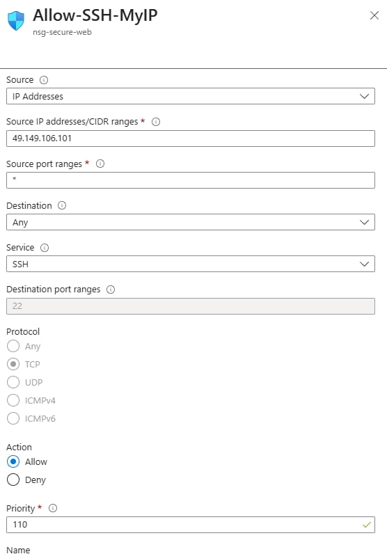

# Project 1: Secure Azure VM Hosting a Web Application (Azure)

## Overview

This project demonstrates the deployment of a **secure, production-style Azure Virtual Machine** hosting a web application. The focus is not just on provisioning compute, but on **security, identity, and operational best practices** expected from a Junior Cloud Engineer in a real-world environment.

The environment is intentionally designed to mirror how cloud resources are deployed and secured in professional settings.

---

## Objectives

* Deploy an Azure Virtual Machine to host a web application
* Secure network access using Network Security Groups (NSGs)
* Enforce least-privilege access principles
* Enable Managed Identity to avoid hardcoded credentials
* Validate public access while maintaining security controls

---

## Architecture

**Components Used:**

* Azure Resource Group
* Azure Virtual Network (VNet)
* Subnet
* Network Security Group (NSG)
* Azure Virtual Machine (Linux)
* Public IP Address
* Managed Identity
* Nginx Web Server

**Traffic Flow:**

* Internet → Public IP → NSG → VM (HTTP 80)
* Administrative access (SSH) restricted to trusted IP only


---

## Step-by-Step Implementation (Mentor-Guided)

This section walks you through the deployment **as if you were on the job**, explaining not just *what* to do, but *why* it is done this way.

---

### Step 1: Create a Resource Group

**Why this matters:** Resource Groups act as logical containers. In real environments, deleting a project cleanly is critical.

1. Go to **Azure Portal** → **Resource groups** → **Create**
2. Configure:

   * Subscription: Your active subscription
   * Resource Group Name: `rg-secure-vm-web`
   * Region: Choose the closest region to you (e.g., Southeast Asia)
3. Click **Review + Create** → **Create**


---

### Step 2: Create the Virtual Network (VNet)

**Why this matters:** Every production VM lives inside a controlled network.

1. Go to **Virtual networks** → **Create**
2. Basics:

   * Name: `vnet-secure-web`
   * Region: Same as Resource Group
3. IP Addresses:

   * Address space: `10.0.0.0/16`
   * Subnet name: `subnet-web`
   * Subnet range: `10.0.1.0/24`
4. Leave other settings as default
5. Review + Create → Create


---

### Step 3: Create the Network Security Group (NSG)

**Why this matters:** NSGs act as firewalls. This is where most cloud security mistakes happen.

1. Go to **Network Security Groups** → **Create**
2. Configure:

   * Name: `nsg-secure-web`
   * Resource Group: `rg-secure-vm-web`
   * Region: Same region
3. After creation, go to **Inbound security rules**
4. Add rule to allow HTTP:

   * Source: Any
   * Source port ranges: *
   * Destination: Any
   * Destination port ranges: 80
   * Protocol: TCP
   * Action: Allow
   * Priority: 100
   * Name: `Allow-HTTP`
  

  
5. Add rule to allow SSH (restricted):

   * Source: IP Addresses
   * Source IP: *Your public IP*
   * Destination port: 22
   * Protocol: TCP
   * Action: Allow
   * Priority: 110
   * Name: `Allow-SSH-MyIP`

 

---

### Step 4: Deploy the Virtual Machine

**Why this matters:** VM configuration reflects cost, security, and performance decisions.

1. Go to **Virtual Machines** → **Create** → Azure virtual machine
2. Basics:

   * Name: `vm-secure-web`
   * Image: Ubuntu Server LTS
   * Size: B1s (cost-efficient for testing)
   * Authentication type: SSH public key
   * Username: `azureuser`
3. Networking:

   * Virtual network: `vnet-secure-web`
   * Subnet: `subnet-web`
   * Public IP: Create new
   * NIC network security group: Advanced
   * Configure NSG: `nsg-secure-web`
4. Leave remaining settings as default
5. Review + Create → Create

  

---

### Step 5: Enable Managed Identity

**Why this matters:** Managed Identity removes the need for stored credentials.

1. Go to the VM → **Identity**
2. System-assigned → Toggle **On**
3. Click **Save**


---

### Step 6: Connect to the VM Securely (SSH)

**Why this matters:** Secure administration is a real operational task.

```bash
ssh azureuser@<VM-PUBLIC-IP>
```

You should be able to connect **only from your allowed IP**.

 

---

### Step 7: Install and Configure Nginx Web Server

**Why this matters:** This simulates hosting a real workload.

```bash
sudo apt update
sudo apt install -y nginx
sudo systemctl enable nginx
sudo systemctl start nginx
```

Open a browser and navigate to:

```
http://<VM-PUBLIC-IP>
```


---

## Security Considerations

* SSH access restricted to a trusted IP
* Password authentication disabled
* Least-privilege network access enforced via NSG
* Managed Identity enabled to prevent credential exposure

---

## Validation & Testing

* Confirm HTTP access from browser
* Confirm SSH access only from allowed IP
* Verify denied access from unauthorized IPs
* Validate Managed Identity status on VM

---

## Cost Awareness

* VM uses low-cost SKU (B1s)
* Resources deployed only when needed
* All resources removed after testing

---

## Cleanup

To avoid unnecessary charges:

* Delete the Resource Group `rg-secure-vm-web`

---

## Key Skills Demonstrated

* Azure Virtual Machine deployment
* Network Security Group configuration
* Secure remote access (SSH)
* Managed Identity implementation
* Cloud security best practices

---

## Resume Bullet (Ready to Use)

> Deployed and secured a public-facing Azure VM hosting a web application using Network Security Groups, restricted administrative access, and managed identities following least-privilege principles.

---

## Lessons Learned

* Importance of restricting administrative access
* Value of Managed Identity over static credentials
* Real-world implications of exposed cloud resources

---

## Status

 Completed 

